Oracle GoldenGateは、Databaseのtransaction logから変更を取り出し、別のDatabaseやstreaming systemへ継続的に届ける論理レプリケーション製品である。このページではOracle Database間のレプリケーションを中心例として、データが通る経路、障害から再開できる理由、GoldenGateが保証する整合性の境界を整理する。

移行時のinitial load、cutover、fallbackは[[cloud/oracle/database/migration/oracledb-goldengate|Oracle GoldenGateによるオンライン移行]]を参照。

## このページの範囲

Doc: [Overview of Oracle GoldenGate](https://docs.oracle.com/en/database/goldengate/core/26/coredoc/overview-oracle-goldengate.html)、[Oracle GoldenGate 26ai Release Notes](https://docs.oracle.com/en/database/goldengate/core/26/release-notes/toc.htm)

このページを読むと、次の判断ができる状態を目指す。

- Extract、Trail、Distribution Service、Receiver Service、Replicatの責任を、1件のtransactionの流れに沿って説明できる
- checkpointによる再開と、並列適用や非同期転送が持つ整合性の境界を区別できる
- GoldenGate、Data Guard physical standby、Data Pumpを、データの表現と目的から使い分けられる
- OCI GoldenGateを選んでも利用者に残る設計・運用責任を説明できる

Oracle GoldenGate 26aiの公式資料を2026-07-24に確認した内容を基準にする。26aiは製品リリース名であり、release／build番号は`23.26.x`系で表記される。個別のsource／target、OS、data type、機能の組み合わせは変化するため、実装時には最新のcertificationとsupport matrixを確認する。

Doc: [Deprecated and Desupported Features and Parameters](https://docs.oracle.com/en/database/goldengate/core/26/release-notes/deprecated-features.html)、[Select a Replicat Type for Your Deployment](https://docs.oracle.com/en/database/goldengate/core/26/coredoc/replicat-select-replicat-type-your-deployment.html)

- Classic ArchitectureはRelease 23.4からdesupportedであり、新規構成はMicroservices Architectureを前提にする
- Integrated ReplicatはRelease 23.4からdeprecatedである
- 現行資料は、特別な機能要件がないOracle Database向けの新規構成ではparallel non-integrated Replicatを推奨している
- `Classic Architecture`と、Microservices Architecture内でも選択できる`classic／non-integrated Replicat`は別の概念である

このページは、install手順、parameterの網羅、個別製品のcertification、license条件を扱わない。

## 全体構造

Doc: [Components of Oracle GoldenGate Microservices Architecture](https://docs.oracle.com/en/database/goldengate/core/26/coredoc/overview-components-oracle-goldengate-microservices-architecture.html)、[About Data Replication Components in Oracle GoldenGate](https://docs.oracle.com/en/database/goldengate/core/26/coredoc/overview-components-data-replication-oracle-goldengate.html)

```mermaid
flowchart LR
  app["Application transaction"] --> source[("Source Database")]
  source -->|"transaction log／redo"| extract["Extract"]
  extract -->|"committed transaction"| localTrail[("Local Trail")]
  localTrail --> distribution["Distribution Service"]
  distribution -->|"Distribution Path"| receiver["Receiver Service"]
  receiver --> targetTrail[("Target Trail")]
  targetTrail --> replicat["Replicat"]
  replicat --> target[("Target Database")]
```

変更は、source Databaseからtarget Databaseへ直接送られるのではない。ExtractとReplicatの間にTrailと転送serviceを置き、capture、network転送、applyを別々の進捗で動かす。

| 構成要素 | 読み取るもの | 出力または変更するもの | 主な責任 |
| --- | --- | --- | --- |
| Extract | sourceのtransaction log | local Trail | 対象transactionをcaptureし、commitされた変更をTrailへ書く |
| Trail | ExtractまたはReceiverが追記したrecord | 後続processが読む連番file | 変更を永続化し、前後のprocessを速度差や停止から分離する |
| Distribution Service | local Trail | network上のDistribution Path | Trail recordを宛先へ配送する |
| Receiver Service | Distribution Path | target Trail | 転送されたrecordを受信し、target側へ永続化する |
| Replicat | target Trail | targetのDML／DDLとcheckpoint | mappingや変換を行い、target transactionとして適用する |
| Administration Service | deployment内の構成とprocess状態 | Extract、Replicat、Path、資格情報などの管理操作 | REST API、Web UI、Admin Clientから構成・制御・監視する |
| Service Manager | host上のdeploymentとservice | serviceの起動・停止とinventory | 1つ以上のdeploymentを監督するwatchdogになる |
| Performance Metrics Service | 各GoldenGate processのmetrics | metrics repositoryと監視interface | status、lag、resource使用量を集約する |
| Deployment | Database向けのservice構成 | Service Manager配下のservice群 | user、security設定、service endpointなどをまとめる構成packageになる |
| Admin Client | operatorのcommand | Administration ServiceへのREST request | Classic ArchitectureのGGSCIに相当するCLIとして構成・制御・監視する |

Distribution Serviceは配送を担い、Replicatが担うようなdata変換は行わない。

Doc: [Oracle GoldenGate Data Streams](https://docs.oracle.com/en/database/goldengate/core/26/coredoc/distribute-oracle-goldengate-data-streams-service.html)、[Add Data Streams](https://docs.oracle.com/en/database/goldengate/core/26/coredoc/distribute-add-data-streams.html)

GoldenGate Data StreamsはDistribution Serviceから作成し、TrailをWebSocket／AsyncAPIで外部clientへ配信する機能である。通常のDatabase間経路に必須となるstandaloneの基本microserviceではない。

> [!NOTE] 説明モデル
>
> 図では変更を運ぶ経路をdata plane、構成・制御・監視を行うservice群をcontrol planeとして分けて考える。これは責任境界を理解するための整理であり、Oracleの正式なarchitecture分類名ではない。

## Transaction logとTrailを使う理由

Doc: [About Extract](https://docs.oracle.com/en/database/goldengate/core/26/coredoc/extract-extract.html)、[Trail File Management](https://docs.oracle.com/en/database/goldengate/core/26/coredoc/administer-trail-file-management.html)

> [!NOTE] 説明モデル
>
> Transaction logは、Databaseがcommitと障害回復のためにすでに生成する変更の時系列である。GoldenGateはこの履歴から差分を読むことで、対象tableの全行を繰り返し比較せずに変更を見つける。Trailはsource logの内容をそのまま複製したfileではなく、GoldenGate process間で受け渡せる形式へ変換した永続bufferである。

この構造により、sourceのcapture、network転送、targetのapplyは同じ瞬間に同じ速度で動く必要がなくなる。例えばnetworkが一時停止しても、Extractは空き容量がある限りlocal Trailへ書き続けられる。Replicatを保守で止めても、target Trailを保持していれば停止位置から再開できる。

一方、非同期化は遅れを消す仕組みではない。後段が前段より長く遅い状態ではTrailが増え続け、最終的にはdisk容量またはsource logの保持期間が復旧可能時間を制限する。

## 1件のtransactionが適用されるまで

Doc: [About Extract](https://docs.oracle.com/en/database/goldengate/core/26/coredoc/extract-extract.html)、[Configure Oracle GoldenGate: Adding Extract and Replicat](https://docs.oracle.com/en/database/goldengate/core/26/coredoc/configure-ogg-adding-extract-and-replicat.html)、[Parallel Replicat](https://docs.oracle.com/en/database/goldengate/core/26/coredoc/replicat-parallel-replicat.html)

1. Applicationがsource DatabaseでDMLを実行し、Databaseがtransaction logへ変更を記録する
2. Extractが対象recordを読み、transactionがcommitまたはrollbackするまで変更を保持する
3. Rollbackされたtransactionは破棄し、commitされたtransactionだけを1つの連続したtransaction単位としてTrailへ書く
4. Trailではtransactionをsourceのcommit順で記録する
5. Distribution ServiceとReceiver Serviceがrecordをtarget Trailへ運ぶ
6. Replicatがmapping、filter、必要な変換を行い、target DatabaseのtransactionとしてDMLを発行する
7. Target transactionのcommitと整合する形でReplicatのcheckpointを進める

Sourceとtargetのtable名やcolumn構成を変えられるのは、物理blockを複製するのではなく、Replicatが論理的な操作として再構成するためである。その代わり、rowを一意に特定するkey、必要なbefore／after image、sourceとtargetの対応関係が明示されていなければならない。

### 並列適用と順序

Parallel Replicatはtransaction間の依存関係を計算し、独立したtransactionを複数のmapper／applierで並列に処理する。Transactionを分割しない既定構成では、同じrowを更新するなど依存するtransactionの順序と、capture対象に含まれるsource transactionのatomicityを維持する。互いに独立したtransactionは並列にcommitできるため、target全体で観測されるcommit順がsourceの全体順と常に一致するわけではない。

例えば、`T1`が顧客A、`T2`が顧客Bだけを更新する場合、Trailには`T1`、`T2`の順に記録されても、targetでは`T2`が先にcommitし得る。一方、`T1`と`T2`が同じ顧客Aを更新する場合は依存関係があり、その順序を反転させない。

このため、GoldenGateを「sourceの全commitを同じ時刻・同じ全体順で再現する同期mirror」と捉えてはいけない。

Doc: [`SPLIT_TRANS_RECS`](https://docs.oracle.com/en/database/goldengate/core/26/reference/split_trans_recs.html)、[`MAXTRANSOPS`](https://docs.oracle.com/en/database/goldengate/core/26/reference/maxtransops.html)

`SPLIT_TRANS_RECS`や`MAXTRANSOPS`のように巨大transactionを分割してcommitするparameterを使うと、source transactionのatomicityを意図的に狭める。性能や回復時間のために適用単位を変える場合は、foreign keyやconstraint、障害時の再開へ与える影響を別に評価する。

## 整合性保証の境界

Doc: [Checkpoint Tables](https://docs.oracle.com/en/database/goldengate/core/26/coredoc/reference-oracle-goldengate-checkpoint-tables.html)、[Configure Oracle GoldenGate: Adding Extract and Replicat](https://docs.oracle.com/en/database/goldengate/core/26/coredoc/configure-ogg-adding-extract-and-replicat.html)、[Switching Replicat from Nonintegrated Mode to Integrated Mode](https://docs.oracle.com/en/database/goldengate/core/26/coredoc/switching-replicat-nonintegrated-mode-integrated-mode.html)、[Oracle GoldenGate Trails](https://docs.oracle.com/en/database/goldengate/core/26/coredoc/reference-oracle-goldengate-trails.html)、[Active-Active High Availability with Oracle GoldenGate](https://docs.oracle.com/en/database/goldengate/core/26/ggsol/active-active.html)

| 境界 | GoldenGateが成立させること | その境界だけでは成立しないこと |
| --- | --- | --- |
| Capture対象 | 必要なlogと設定がある対象operationについて、commitされたtransactionをTrailへ書く | 対象外object、記録されなかったcolumn、unsupported operationの復元 |
| Transaction | Transaction分割parameterを使わない構成では、1つのExtract groupがcaptureしたoperationをsource transaction境界の連続した単位としてTrailへ記録し、Replicatがtarget transactionとして適用する | 関連変更を複数groupへ不適切に分割した場合や、transaction分割parameterを使った場合のsource transaction atomicity |
| 障害再開 | Trail上の位置とtransactional checkpointを使い、適用済みtransactionの再適用を防いで再開する | 手動のposition変更、`SKIP`、不整合なcheckpoint、任意の外部side effectまで含む重複排除 |
| 順序 | Transaction分割parameterを使わない構成では、依存するtransactionの順序とsource transaction atomicityを維持する | 並列適用される独立transactionのglobalなcommit順 |
| 時間 | Lagを測りながらsourceの変更へ継続追従する | Source commitと同時にtarget commitを完了する同期性、常時lag `0`、data loss `0` |
| 双方向 | Loop detectionとconflict処理を構成して両方向へ変更を運べる | 同じrowを両側から更新したときの自動的で業務的に正しい勝者決定 |

Recovery情報の保持先はReplicat typeで異なる。Non-integrated Replicatのcheckpoint tableはtarget Database内に置かれ、checkpoint更新とReplicat transactionが同時に成功または失敗するため、障害後も同じtransactionを一度だけ適用する。Integrated ReplicatはDatabase inbound server内のrecovery情報とcheckpoint fileを使う。Trailと各方式のcheckpoint／recovery情報を組み合わせ、適用済みの位置を識別して再開する。

> [!NOTE] 境界の解釈
>
> ここでの「一度だけ」は、整合したTrail、Replicat typeに対応するcheckpoint／recovery情報、通常のtarget transactionという境界の保証である。Transaction分割parameterを使うと、適用単位自体がsource transactionより小さくなる。Message queueへの送信、非transactionalな外部処理、利用者によるposition変更まで含むapplication全体のexactly-once semanticsを意味しない。

GoldenGateは非同期レプリケーションである。Sourceでcommitが成功した時点では、その変更がtargetへ到着またはcommitしているとは限らない。Source障害時に許容できるdata loss、targetへ切り替えられる条件、未転送Trailの扱いは、GoldenGate processとは別に設計する。

## レプリケーションが成立する前提

Doc: [Transaction Log Settings and Requirements for Oracle](https://docs.oracle.com/en/database/goldengate/core/26/coredoc/prepare-transaction-logs-settings-and-requirements-ogg-oracle.html)、[Ensuring Row Uniqueness in Source and Target Tables](https://docs.oracle.com/en/database/goldengate/core/26/coredoc/prepare-ensuring-row-uniqueness-source-and-target-tables.html)、[Understanding What's Supported for Oracle](https://docs.oracle.com/en/database/goldengate/core/26/coredoc/prepare-oracle-understanding-whats-supported.html)、[Instantiating Oracle GoldenGate with an Initial Load](https://docs.oracle.com/en/database/goldengate/core/26/coredoc/instantiate-instantiating.html)

| 前提 | 必要になる理由 | 崩れた場合 |
| --- | --- | --- |
| Source logが完全で保持される | Extractが対象変更と回復位置を後から読めるようにする | 変更をcaptureできないか、障害後に必要なlogまで戻れない |
| Supplemental loggingが必要columnを含む | Replicatがrow識別、dependency計算、before imageの比較に必要な値を得る | Key不足、誤ったrow検索、apply error、競合検出不能につながる |
| 安定したprimary keyまたはunique keyがある | Replicatがtarget rowを一意かつ効率的に特定する | 適切なkeyがない場合は利用可能な全columnをpseudo keyにし、capture量とtarget検索costが増える |
| Source／targetのobjectとoperationがsupportedである | Logical applyではdata type、DDL、Database機能ごとに扱いが異なる | ExtractまたはReplicatのerror、欠落、別手順による移行が必要になる |
| Target schemaとmappingが整合する | Replicatがsource operationを有効なtarget DMLへ変換する | Column不一致、constraint、trigger、character setなどでapplyが停止する |
| Baselineと開始位置が同じ整合点を指す | 既存dataと開始後の差分を重複も欠落もなく接続する | Initial loadとCDCの間にgapまたはduplicateが生じる |
| LogとTrailに十分な保持容量がある | Outageやlong-running transactionの間も必要な履歴を残す | Trail fullによる停止、log欠落、再initial loadが必要になる |
| Network、credential、certificateを両端で維持する | Microservices間とDatabase接続の認証・転送を継続する | Path停止、process abend、credential更新後の接続失敗につながる |

Oracle Database sourceでは、`ARCHIVELOG`、`ENABLE_GOLDENGATE_REPLICATION=TRUE`、適切なdatabase／schema／table supplemental loggingなどを構成する。`FORCE LOGGING`は、GoldenGateで扱う変更がredoを迂回しないよう強く推奨される。

Primary keyも適切なunique keyもないtableでは、GoldenGateは利用可能な全columnからpseudo keyを作る。これは「keyがなくても同じ保証で動く」という意味ではない。LOBなどkeyに使えないcolumnがあり、同じ値のrowが複数存在すれば一意性を確保できず、target側の全column検索も高costになる。必要に応じて`KEYCOLS`でreplication用の識別columnを指定する。

Doc: [Enabling DDL Support](https://docs.oracle.com/en/database/goldengate/core/26/coredoc/extract-oracle-enabling-ddl-support.html)

DDL captureはDMLと別に有効化・構成する。Oracle Database間のDDL replicationも、異なる定義を任意に変換する機能ではない。Sourceとtargetで定義を変える場合は、適用するDDLの所有側、実行順、mapping、互換性を別途設計する。

## 類似方式との違い

Doc: [Oracle GoldenGate](https://docs.oracle.com/en/database/oracle/oracle-database/26/haovw/oracle-goldengate.html)、[Oracle Active Data Guard and Oracle GoldenGate](https://docs.oracle.com/en/database/oracle/oracle-database/26/haovw/best-practice-oracle-active-data-guard-and-oracle-goldengate.html)、[Getting Started with Oracle Data Guard](https://docs.oracle.com/en/database/oracle/oracle-database/26/sbydb/getting-started-with-oracle-data-guard.html)、[Oracle Data Pump](https://docs.oracle.com/en/database/oracle/oracle-database/26/sutil/oracle-data-pump.html)

| 比較軸 | GoldenGate | Data Guard physical standby／Active Data Guard | Data Pump |
| --- | --- | --- | --- |
| Dataの表現 | Transaction logから論理変更を抽出し、target DMLとして適用する | RedoをDatabase recovery機構で適用し、Database全体の物理copyを維持する | Dataとmetadataをlogical export／importする。通常のdump file setに加え、network importやtransportable方式もある |
| 時間モデル | 継続的な非同期CDC | 継続的なredo転送・apply | 境界時点を持つ有限のexport／import job |
| 選択粒度 | Database、schema、table、row、columnを選択し、mappingや変換を加えられる | 通常はCDB全体。Data Guard PDBでは1つ以上のPDB単位 | Database、schema、tableなどjob単位で選択できる |
| Source／target | 認定範囲で異種DBMS、異なるversionやschemaを扱える | Oracle Database間で物理的に同じDatabaseを維持する | 主にOracle Database間のlogical movement |
| Targetの役割 | 同期中もread-writeにでき、one-way、bidirectional、fan-outなどを構成できる | Physical standbyはstandby roleであり、Active Data Guardはapply中のread-only利用を加える | Import後に独立したDatabaseとして利用する |
| 主目的 | 継続CDC、data配布・統合、異種連携、read-write replica、online migration | Database全体のdata protection、HA、DR、switchover／failover | 初期load、論理export、再編、有限の移行。物理recovery backupとは別 |
| 主な設計課題 | Key、logging、lag、conflict、mapping、Trail保持 | Protection mode、redo transport、standby apply、failover | Export整合点、dump容量、import時間、object再作成 |

Data Guardにはlogical standbyもあるため、製品全体を単純に「Data Guardは物理、GoldenGateは論理」と二分しない。上の比較は、data protectionとDRで中心になるphysical standby／Active Data Guardを対象にする。

Doc: [Managing Data Guard Broker Configurations](https://docs.oracle.com/en/database/oracle/oracle-database/26/dgbkr/managing-oracle-data-guard-broker-configurations.html)

Data Guard PDBは1つ以上のPDBを保護できるが、GoldenGateのようにtable、row、columnを選択して変換する仕組みではない。

Data PumpとGoldenGateは排他的ではない。Data Pumpでbaselineを作り、その間に発生した変更をGoldenGateで追従させると、全量copyの速度とcutover停止時間を別々に最適化できる。

Doc: [Zero Downtime Migration](https://docs.oracle.com/en/database/oracle/zero-downtime-migration/26.1/zdmer/)、[OCI Database Migration](https://docs.oracle.com/en-us/iaas/database-migration/doc/oracle-cloud-infrastructure-database-migration.html)、[OCI Database Migration Online Migration](https://docs.oracle.com/en-us/iaas/database-migration/doc/online-migration.html)

ZDMは方式に応じてData Pump、GoldenGate、Data Guard、RMANを調整する。OCI Database MigrationはZDM engineを利用するmanaged serviceであり、Oracle Database向けの現行workflowではoffline migrationと、initial load後にGoldenGateで一方向に追従するonline logical migrationを提供する。どちらもprecheckからcutoverまでの有限の移行jobを調整し、継続CDCを行うGoldenGateのdata pathそのものとは責任が異なる。方式選定は[[cloud/oracle/database/migration/oci-oracledb-migration|OCI Oracle Database移行概要]]を参照。

## OCI GoldenGateと自己管理型

Doc: [Oracle Cloud Infrastructure GoldenGate](https://docs.oracle.com/en-us/iaas/goldengate/doc/oracle-cloud-infrastructure-goldengate1.html)、[OCI GoldenGate Shared Responsibility Model](https://docs.oracle.com/en-us/iaas/goldengate/doc/shared-responsibility-model.html)、[OCI GoldenGate Versions](https://docs.oracle.com/en/cloud/paas/goldengate-service/ocigg/oracle-cloud-infrastructure-goldengate-versions.html)

| 責任 | OCI GoldenGate | 自己管理型GoldenGate |
| --- | --- | --- |
| Compute、OS、GoldenGate infrastructure | Oracleがservice infrastructureを管理する | 利用者がhost、storage、OS、HAを構築・管理する |
| Deploymentのprovisioningとbackup | Oracleがprovisioningと日次backupを実行し、利用者が作成／restore requestを開始する | 利用者がinstall、backup、restoreを実行する |
| Patch／upgrade | Oracleが提供・適用する。利用者が期限内の開始・保守時刻を管理し、未実施なら期限後に自動upgradeされ得る | 利用者がpatch取得、検証、停止、適用、rollbackを管理する |
| Base OCPUとautoscaling | 利用者が必要容量とautoscaling設定を管理する | 利用者がcompute shapeとscalingを管理する |
| Service Manager | OCI service側で管理され、利用者へ公開されない | 利用者が配置・冗長化・監視する |
| Extract、Replicat、Pathの設計 | 利用者 | 利用者 |
| Processの性能とlag監視 | 利用者 | 利用者 |
| Source／targetの準備 | 利用者 | 利用者 |
| Connection、IAM、network、certificate | 利用者 | 利用者 |
| Mapping、error処理、data検証 | 利用者 | 利用者 |

OCI GoldenGateの`fully managed`は、hostとGoldenGate infrastructureの運用をserviceへ移すことを意味する。どの変更をcaptureするか、targetで正しく適用できるか、lagが許容範囲か、dataが業務上一致するかまでOracleが自動的に保証する意味ではない。

Doc: [Provisioning Oracle GoldenGate on OCI Marketplace](https://docs.oracle.com/en/database/goldengate/core/26/oggmp/provisioning-oracle-goldengate-microservices-oci-marketplace.html)

Oracle GoldenGate on OCI Marketplaceは、OCI Compute上へGoldenGateをprovisionしやすくする自己管理型の提供形態であり、OCI GoldenGate managed serviceとは異なる。

## 制約と失敗パターン

Doc: [Bounded Recovery](https://docs.oracle.com/en/database/goldengate/core/26/coredoc/extract-bounded-recovery.html)、[Estimating Space for Trails](https://docs.oracle.com/en/database/goldengate/core/26/coredoc/extract-estimate-space-trails.html)、[Automating Maintenance Tasks](https://docs.oracle.com/en/database/goldengate/core/26/coredoc/automate-maintenance-tasks-1.html)、[Using Multiple Process Groups](https://docs.oracle.com/en/database/goldengate/core/26/coredoc/using-multiple-process-groups.html)、[Configuring Bidirectional Replication](https://docs.oracle.com/en/database/goldengate/core/26/coredoc/administer-configuring-bi-directional-replication.html)

| 失敗パターン | 因果関係 | 主な結果 |
| --- | --- | --- |
| Source loggingが不足する | Key columnやbefore imageがlogへ残らず、Extractが必要な値を得られない | Capture error、誤ったrow特定、再initial load |
| 安定したkeyがない | Replicatが全columnでrowを検索し、一意性とindex利用を期待できない | Apply低速化、複数row一致、missing row error |
| Initial loadと開始位置がずれる | Baselineより前または後の変更からReplicatを開始する | Duplicateまたは欠落 |
| Long-running transactionを考慮しない | Extractがcommit待ちの変更と必要なsource logを長く保持する | Cache／disk消費、recovery長期化、必要logの欠落 |
| Networkまたはapplyが長時間遅れる | 前段はTrailを生成し続け、後段が消費できない | Lag増加、Trail disk full、Extract停止 |
| Trailを早くpurgeする | 全consumerのcheckpointより前に必要fileを消す | 再開位置を読めず、再同期が必要になる |
| DDL／schema driftを無計画に許す | Source operationとtarget definitionの対応が崩れる | Replicat abend、discard、誤ったmapping |
| 関連transactionを複数groupへ分割する | GroupごとのTrailとcheckpointが独立して進む | Cross-table dependencyやatomicityが崩れる |
| Active-activeで同じkeyを両側から更新する | 非同期伝播の間に競合変更が成立する | Update conflict、insert collision、業務的に誤った解決 |
| Loop detectionを構成しない | Replicatが適用した変更を反対側のExtractが再captureする | 同じ変更の往復、重複、endless loop |

Long-running transactionとoutageに耐えられる時間は、単一のparameterでは決まらない。Source archive logの保持、Extract recovery state、local／target Trail容量、network throughput、Replicat throughputのうち最も短い境界が復旧可能時間になる。

## 監視で見る状態

Doc: [Monitoring Lag](https://docs.oracle.com/en/database/goldengate/core/26/coredoc/monitor-monitor-lag.html)、[OCI GoldenGate Metrics](https://docs.oracle.com/en-us/iaas/goldengate/doc/metrics.html)

| 観測対象 | 分かること | それだけでは分からないこと |
| --- | --- | --- |
| Extract status／lag | Source logからcaptureできているか、captureがsourceへどれだけ遅れているか | Targetへ適用済みか |
| Distribution／Receiver status | Trailを宛先へ配送できているか | Target DMLが成功したか |
| Replicat status／lag | Target Trailを読み、applyが進んでいるか | Sourceとtargetの全rowが業務的に一致するか |
| Heartbeat | Capture、transport、applyを通したend-to-end lag | Heartbeat対象外のobjectやunsupported operationの正しさ |
| Checkpoint age | 各processの再開位置が進んでいるか | 停止原因の詳細 |
| Trail disk使用量 | Backlogがdisk上でどれだけ増えているか | Source logがいつまで保持されるか |
| Error、discard、report | どのrecordやoperationで失敗したか | Silentなmapping誤りや業務rule違反 |

`RUNNING`はprocessが動いている状態であり、dataが正しい状態と同義ではない。Process healthとlagに加えて、source log retention、Trail増加率、long-running transaction、checkpoint、error／discard、schema変更を関連付けて監視する。重要tableはrow countだけでなく、business key、aggregate、LOB、時刻境界を使ってdataを比較する。

## 関連する深掘り

- [[cloud/oracle/database/migration/oracledb-goldengate|Oracle GoldenGateによるオンライン移行]]：initial load、SCN、cutover、reverse replication
- [[cloud/oracle/database/migration/oci-oracledb-migration|OCI Oracle Database移行概要]]：移行方式全体の選択
- [[cloud/oracle/database/migration/oracledb-data-guard|Oracle Data GuardによるDatabase移行]]：物理standbyを使うonline migration
- [[cloud/oracle/database/migration/oracledb-data-pump|Oracle Data PumpによるDatabase移行]]：logical initial loadと有限のdata movement
- [[cloud/oracle/database/migration/oci-zero-downtime-migration|Oracle Zero Downtime Migration]]：複数の移行engineを調整するorchestration
- [[cloud/oracle/database/migration/oci-database-migration-service|OCI Database Migration]]：OCIのmanaged migration job
- GoldenGate Data Streams：TrailをWebSocket／AsyncAPIでevent consumerへ配信する場合のQoSとschema
- GoldenGate Veridata：稼働中のsource／target比較と不一致修復の境界
- Active-active設計：loop防止、key space分割、conflict detection／resolution、write ownership
- GoldenGate自体のHA：Service Manager、deployment、Trail storage、process failoverの配置設計

## References

- [Oracle GoldenGate 26ai Documentation](https://docs.oracle.com/en/database/goldengate/core/26/index.html)
- [Oracle GoldenGate 26ai Release Notes](https://docs.oracle.com/en/database/goldengate/core/26/release-notes/toc.htm)
- [Oracle Maximum Availability Architecture: Oracle GoldenGate](https://docs.oracle.com/en/database/oracle/oracle-database/26/haovw/oracle-goldengate.html)
- [OCI GoldenGate Documentation](https://docs.oracle.com/en-us/iaas/goldengate/)
