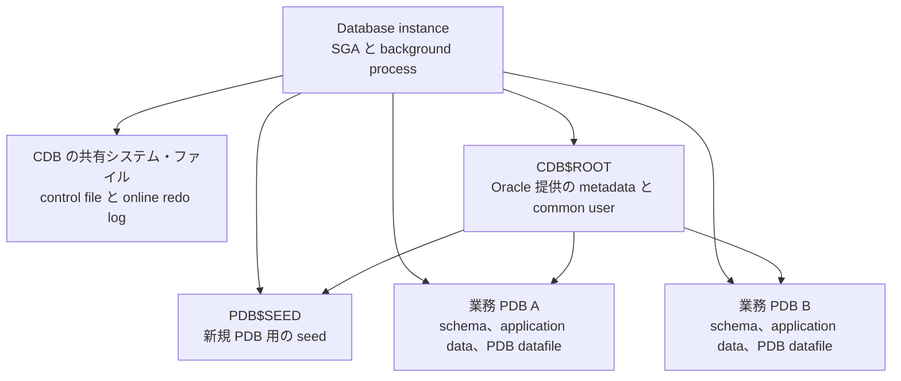

Oracle Multitenant は、複数のアプリケーション Database を一つの物理 Database に集約しつつ、PDB ごとには独立した Database として見せるアーキテクチャである。OS のプロセスを隔離する Docker などのコンテナとは異なり、共有するのは Oracle Database のインスタンスと基盤ファイルであり、PDB はその中の論理的な Database 境界である。

Oracle Database 21c 以降は CDB を使う Multitenant アーキテクチャだけがサポートされ、従来の non-CDB は新規作成できない。

このメモでは、CDB と PDB の責任境界、共有される資源、運用への影響を扱う。PDB の移行手順、アプリケーション・コンテナ、RAC や Data Guard の個別構成は範囲外とする。

## 全体構造

Doc: [Introduction to Multitenant Administration](https://docs.oracle.com/en/database/oracle/oracle-database/26/multi/introduction-to-the-multitenant-architecture.html)

**CDB（Container Database）**は、制御ファイル、オンライン REDO ログ、データファイルで構成される物理 Database である。Database instance はこれらのファイルを管理する。一つの CDB は、通常の単一インスタンス構成だけでなく、RAC では複数インスタンスから利用できる。

**PDB（Pluggable Database）**は、schema、schema object、非 schema object をまとめた可搬な単位である。アプリケーションからは独立した Database として見え、各 PDB は業務データを格納する自分のデータファイルを持つ。PDB を unplug すると、PDB のデータファイルと metadata file が得られ、別の互換 CDB へ plug できる。

**`CDB$ROOT`**は、全 PDB が属する root container である。Oracle 提供の metadata と common user を置き、業務のユーザーデータを置く場所ではない。CDB 全体を管理する接続は `CDB$ROOT` に対して行う。

**`PDB$SEED`**は、新規 PDB の作成元となる Oracle 提供の seed PDB である。これは業務 PDB ではなく、変更して利用する対象ではない。

この図で `CDB$ROOT` が PDB を「管理する箱」のように見えても、`CDB$ROOT` は別の管理プロセスではない。CDB は instance と物理ファイルを共有する Database 全体であり、`CDB$ROOT` はその中で共通 metadata を担う container である。

## なぜ集約と分離を両立させるのか

Doc: [Benefits of the Multitenant Architecture](https://docs.oracle.com/en/database/oracle/oracle-database/26/multi/introduction-to-the-multitenant-architecture.html)

非 CDB 構成で Database ごとに instance を持つと、background process とメモリ領域が Database ごとに必要になり、パッチ、バックアップ、監視も個別に管理することになる。CDB は複数 PDB で instance と計算資源、メモリ資源を共有するため、集約によって基盤と運用作業を減らせる。

一方で、業務データと PDB 固有の data dictionary metadata は PDB に置く。この分離により、PDB を単位として作成、clone、unplug／plug、open／close、PDB 単位の Flashback や Point-in-Time Recovery を行える。

> [!NOTE] 説明モデル
>
> CDB は「基盤を共有する運用単位」、PDB は「アプリケーションを独立した Database として扱う単位」と捉えるとよい。実際の操作には CDB 全体、PDB 個別、RAC、バックアップ方式などの条件が重なるため、この二分だけで可否を判断するわけにはいかない。

## 共有するものと PDB ごとに分かれるもの

| 観点 | CDB 側で共有または管理するもの | PDB ごとに分かれるもの | 運用上の帰結 |
| --- | --- | --- | --- |
| 実行基盤 | Database instance、SGA、background process | PDB 専用の instance は持たない | CPU とメモリは競合し得る |
| 物理ファイル | control file、online redo log、CDB の system datafile | 業務データを持つ datafile | CDB 基盤の障害は複数 PDB に影響し得る |
| metadata | `CDB$ROOT` の Oracle 提供 metadata、common user | schema、業務 object、PDB 固有の dictionary metadata | 同じ CDB に集約しても業務データを PDB 単位で管理できる |
| 管理操作 | CDB の起動、共通設定、CDB 全体を対象にする backup や patch | PDB の作成、open／close、schema 変更、PDB 単位の回復 | 操作の対象が CDB か PDB かを毎回確認する |
| 可搬性 | CDB は PDB の受け入れ先になる | PDB は unplug／plug や clone の対象になる | Database 全体ではなく PDB 単位で移行計画を立てられる |

PDB は他 PDB と論理的に分離されるが、物理的な障害ドメインや資源ドメインまで分離するわけではない。これは、instance、制御ファイル、オンライン REDO ログが CDB 内で共有されることから導ける設計上の帰結である。PDB 間で CPU、メモリ、I/O が競合する構成では、Oracle Resource Manager で PDB ごとの資源配分を管理する。

## ユーザーと権限の境界

Doc: [Users, Roles, and Objects in a Multitenant Environment](https://docs.oracle.com/en/database/oracle/oracle-database/26/multi/introduction-to-the-multitenant-architecture.html)

| 種別 | 作成する場所 | 有効範囲 | 典型的な用途 |
| --- | --- | --- | --- |
| **common user** | `CDB$ROOT` | 同じ CDB の root と PDB。権限は container ごとに異なり得る | CDB 全体の管理、複数 PDB をまたぐ管理作業 |
| **local user** | 個別 PDB | 作成した PDB のみ | アプリケーション schema、PDB ごとの管理 |

common user は `CDB$ROOT` で定義され、既存および将来の PDB で同じ identity を持つ。ただし、同じ identity だからといって、すべての PDB で同じ権限を自動的に持つわけではない。

local user は一つの PDB に閉じる。別 PDB には同名の local user を作成できるが、それらは別の user と schema であり、直接相互にアクセスできない。

この区別により、CDB 管理者が共通基盤を扱い、PDB 管理者やアプリケーション所有者が個別 PDB を扱う責任分担を作れる。

## PDB を単位にしたライフサイクル

Doc: [Creating a PDB from Scratch](https://docs.oracle.com/en/database/oracle/oracle-database/26/multi/creating-a-pdb-from-scratch.html)

1. CDB を作成すると、`CDB$ROOT` と `PDB$SEED` が作られる。
2. `PDB$SEED` を元にするか、別 CDB の PDB を plug して、業務用 PDB を作成する。
3. PDB 内に local user、schema、application data を作成し、アプリケーションは対象 PDB へ接続する。
4. PDB ごとに open／close、clone、unplug／plug、回復を行う。

PDB の可搬性は、PDB を単位にデータと metadata を持つことから得られる。ただし、別 CDB への移動では Database release、`COMPATIBLE`、character set、option、TDE key、接続先 service などの互換性を確認する必要がある。詳細は [[cloud/oracle/database/migration/oracledb-pdb-migration|Oracle Multitenant PDB 移行]]を参照。

## 設計と運用で確認すること

- アプリケーションごとに、PDB を分ける理由と、同じ PDB に置く schema を明確にする。
- CDB 停止、CDB 基盤障害、CDB 単位の patch が各 PDB へ与える影響を可用性設計に含める。
- PDB 間の CPU、メモリ、I/O の競合を測定し、必要なら Resource Manager の方針を設ける。
- common user に与える権限を最小化し、通常のアプリケーション user は local user として PDB に閉じる。
- backup と recovery の対象が CDB 全体か特定 PDB かを定め、PDB 移行後には target 側の backup 方針へ組み込む。

## 関連する深掘り

- [[cloud/oracle/database/migration/oracledb-pdb-migration|PDB clone、unplug／plug、relocate を使う移行]]
- [[cloud/oracle/database/backup/oci-oracledb-backup|CDB／PDB の backup と recovery]]
- [[cloud/oracle/database/security/oracledb-tde|PDB 移行時の TDE key と keystore]]
- application container と application PDB による SaaS 向けの共通 metadata 管理
- Oracle Resource Manager による PDB 間の資源配分

## References

- [Introduction to Multitenant Administration, Oracle AI Database 26ai](https://docs.oracle.com/en/database/oracle/oracle-database/26/multi/introduction-to-the-multitenant-architecture.html)（2026-07-26 確認）
- [Multitenant Container Database (CDB), Oracle AI Database 26ai](https://docs.oracle.com/en/database/oracle/oracle-database/26/dbiad/db_cdb.html)（2026-07-26 確認）
- [いまさら遅い？Oracle Databaseのコンテナ技術, Re:Q](https://www.reqtc.com/blog/oracle-pdb-cdb.html)（2023-06-28 公開、概念導入の補足資料）
