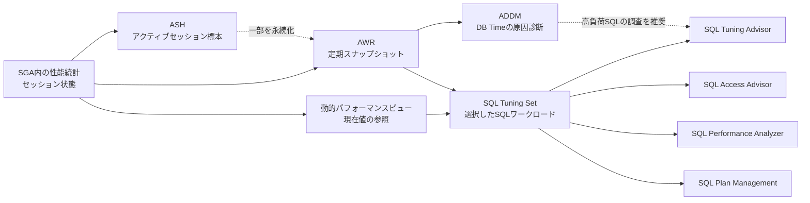

## 概要

- Oracle Database の性能管理は、計測、履歴化、診断、チューニング、変更前後の検証、実行計画の安定化に分かれる
  - 動的パフォーマンスビュー、Active Session History（ASH）、Automatic Workload Repository（AWR）は性能情報を提供する
  - Automatic Database Diagnostic Monitor（ADDM）と各アドバイザは、性能情報やSQLを分析して所見と推奨事項を生成する
  - SQL Tuning Set（STS）は、選択したSQLワークロードを再利用、移送するためのDatabaseオブジェクトであり、診断エンジンではない
  - SQL Performance Analyzer（SPA）とDatabase Replayは、変更前後の回帰を異なる粒度で検証する
  - SQL Plan Management（SPM）は、既知または検証後に受け入れた実行計画をSQL計画ベースラインとして保持し、計画変更による回帰を抑える
- ADDMとSTSは直接の入出力関係にない
  - ADDMはAWRスナップショットを分析する
    - STSはAWR、共有SQL領域、SQL Traceなどから選択したSQLと実行情報を保持し、SQL Tuning Advisor、SQL Access Advisor、SPAなどへ渡す
    - ADDMが高負荷SQLを特定し、SQL Tuning Advisorの実行を推奨することで両者のワークフローが接続する場合がある
- **OCI Database Managementは、Database内機能のUIだけではない**
  - AWR、ADDM、ASH、STS、SQL Tuning Advisor、SPMなどについては、Database内のビュー、パッケージ、オブジェクトをOCIから参照、実行、可視化する
  - OCI側では、IAM、Managed Databaseリソース、接続経路、メトリック保管、アラーム、ダッシュボード、フリート管理、ジョブ、APIも提供する
  - 「Databaseホストの機能」よりも、「Databaseエンジン内の機能を利用するOCI管理プレーン」と捉える方が正確である

Doc: [Performance Tuning Overview](https://docs.oracle.com/en/database/oracle/oracle-database/26/tgdba/performance-tuning-overview.html)

Doc: [Diagnostics & Management Feature Support Matrix for Oracle Databases](https://docs.oracle.com/en-us/iaas/database-management/doc/database-management-feature-support-matrix.html)

## 性能情報と分析機能の関係

DB Timeは、フォアグラウンドセッションがDatabase処理に費やした時間の合計であり、CPU使用時間とアイドル以外の待機時間からなる。

SGA内の性能統計やセッション状態は、用途に応じて現在値、定期スナップショット、アクティブセッション標本として参照、保存される。

- AWRはDatabase全体の履歴を保持し、ADDMは2つのスナップショット間で消費されたDB Timeを基準に原因と影響を分析する
- ASHはアクティブセッションだけを標本化するため、待機クラス、SQL ID、セッション、モジュールなどの軸で負荷を掘り下げる
- STSは対象SQLをワークロードとして切り出すため、アドバイザ間の再利用、別Databaseへの移送、変更前後の比較に使える
- アドバイザの推奨事項は適用前の候補であり、適用後の性能と副作用を実測して初めて効果を判断できる

## 性能情報

Doc: [Gathering Database Statistics Using the Automatic Workload Repository](https://docs.oracle.com/en/database/oracle/oracle-database/26/tdppt/gathering-database-statistics-using-automatic-workload-repository.html)

Doc: [Measuring Database Performance](https://docs.oracle.com/en/database/oracle/oracle-database/26/tgdba/measuring-database-performance.html)

Doc: [Capturing Workloads in SQL Tuning Sets](https://docs.oracle.com/en/database/oracle/oracle-database/26/tgsql/managing-sql-tuning-sets.html)

Doc: [Monitoring Database Operations](https://docs.oracle.com/en/database/oracle/oracle-database/26/tgsql/monitoring-database-operations.html)

| 情報源／オブジェクト | 保持する単位 | 主な保存場所と期間 | 主な用途 |
| --- | --- | --- | --- |
| 動的パフォーマンスビュー | インスタンス、セッション、待機、SQLなどの現在値と累積値 | 主にSGA内。インスタンス再起動やメモリ上の循環領域の影響を受ける | 現在の状態確認、性能統計やセッション状態の参照 |
| ASH | 1秒ごとに標本化したアクティブセッション | `V$ACTIVE_SESSION_HISTORY`の循環バッファ。一部をAWRの履歴へ永続化 | 短時間のスパイク、待機、SQL、セッション、実行計画箇所の絞り込み |
| AWR | 時間モデル、待機、システム、セッション、高負荷SQLなどのスナップショット | Database内の履歴リポジトリ。既定は1時間間隔、8日保持で変更可能 | 時系列比較、AWRレポート、ADDM、過去のSQLと実行計画の調査 |
| Real-Time SQL Monitoring | 監視対象となった1回のSQLまたはDatabase操作 | 実行中はメモリ上の詳細統計、完了後はレポートリポジトリへ保存される場合がある | 長時間SQLまたはパラレルSQLの進捗、実行計画行ごとの時間とI/Oの確認 |
| STS | SQLテキスト、スキーマやモジュールなどの実行コンテキスト、バインド値、実行統計、任意の実行計画 | 名前を持つ永続的なDatabaseオブジェクト | アドバイザの入力、SPA、別Databaseへのワークロード移送、SPMへの実行計画読込み |

### AWR、ASH、STSの境界

- AWRはDatabase全体の履歴リポジトリであり、特定の検証用ワークロードではない
- ASHはAWRの別名ではなく、アクティブセッションを高頻度で標本化したデータである
- STSは選択したSQLを名前付きオブジェクトとして保持するワークロード集合であり、時間の経過に伴うDatabase全体の状態を自動的に保持しない
- STSにはSQLの実行順序やセッション間の並行性が含まれないため、システム全体の再現にはDatabase Replayを使う
- AWRからSTSを作成できるが、STSを作成しただけではSQLの診断、実行、比較は行われない

## 診断と助言

Doc: [Automatic Performance Diagnostics](https://docs.oracle.com/en/database/oracle/oracle-database/26/tgdba/automatic-performance-diagnostics.html)

Doc: [Using ADDM in a Multitenant Environment](https://docs.oracle.com/en/database/oracle/oracle-database/26/tdppt/addm-oracle-multitenant-environment.html)

Doc: [Analyzing SQL with SQL Tuning Advisor](https://docs.oracle.com/en/database/oracle/oracle-database/26/tgsql/sql-tuning-advisor.html)

Doc: [Optimizing Access Paths with SQL Access Advisor](https://docs.oracle.com/en/database/oracle/oracle-database/26/tgsql/sql-access-advisor.html)

| 機能 | 入力 | 分析対象 | 主な出力 |
| --- | --- | --- | --- |
| ADDM | 通常は連続する2つのAWRスナップショット | Database全体（RACでは全インスタンス）、単一インスタンス、PDB | DB Timeへの影響で順位付けした根本原因、症状、情報、警告、推奨事項 |
| Real-Time ADDM | 現在のインメモリ性能情報 | 現在のDatabaseの応答低下、ハング、高負荷 | デッドロック、共有プール競合、応答不能などの所見と対処候補 |
| ADDM Spotlight | 複数時点のADDMタスクとDatabaseパラメータ | 一定期間に反復する所見と推奨事項 | 頻度、最大影響、推定改善効果、パラメータ変更を集約した時系列表示 |
| SQL Tuning Advisor | 1つ以上のSQL、またはSTS | 個別SQL | オブジェクト統計、索引、SQL書換え、SQLプロファイル、SQL計画ベースラインの推奨 |
| SQL Access Advisor | 代表的なSQLワークロード。通常はSTS | ワークロード全体とスキーマ構造 | 索引、マテリアライズドビュー、マテリアライズドビューログ、パーティションなどの推奨 |

- ADDM SpotlightはADDMとは別の診断エンジンではなく、複数のADDM結果を時系列で集約する表示機能である
- ADDMタスク、所見、推奨事項は、AWRスナップショットそのものではなくDatabase内のアドバイザ・リポジトリで参照する
- PDBレベルのADDMは19c以降で利用でき、PDB単位のAWRスナップショットを前提とする
  - `AWR_PDB_AUTOFLUSH_ENABLED`の既定値はバージョンで異なり、26aiでは`TRUE`であるため、対象バージョンとスナップショット設定を確認する
- 推奨された索引やマテリアライズドビューは対象SQLを改善してもDML、ストレージ、保守のコストを増やすため、STSや実アプリケーションの代表性を確認する

## ワークロードの検証と計画安定化

Doc: [Introduction to SQL Performance Analyzer](https://docs.oracle.com/en/database/oracle/oracle-database/26/ratug/introduction-to-sql-performance-analyzer.html)

Doc: [Introduction to Database Replay](https://docs.oracle.com/en/database/oracle/oracle-database/26/ratug/introduction-to-database-replay.html)

Doc: [Overview of SQL Plan Management](https://docs.oracle.com/en/database/oracle/oracle-database/26/tgsql/overview-of-sql-plan-management.html)

| 機能 | 保持または再現するもの | 変更前後の評価 | 主な境界 |
| --- | --- | --- | --- |
| STS | 選択したSQL、実行コンテキスト、実行統計、任意の実行計画 | それ自体は比較しない | SQLの順序、同時実行性、要求間隔、トランザクション依存関係は保持しない |
| SPA | STS内の各SQLから作成した変更前後の試行 | `TEST EXECUTE`では実行計画、経過時間、CPU、I/Oを比較し、`EXPLAIN PLAN`では実行計画とオプティマイザコストを比較する | 各SQLを独立して扱うため、セッション間競合やトランザクション全体は再現しない |
| Database Replay | 本番環境でキャプチャした外部クライアント要求 | キャプチャ時と同じタイミング、同時実行性、トランザクション依存関係でテスト環境へリプレイし、システム全体への影響を比較する | アプリケーションUIや外部システムを含むエンドツーエンドテストの代替ではなく、リプレイ差異も確認する |
| SPM | SQLごとの実行計画履歴と受入れ済み実行計画からなるSQL計画ベースライン | 新しい実行計画を既知の実行計画と比較し、検証後に受け入れられる | 性能を計測する機能ではなく、オプティマイザが利用できる実行計画を制御する予防機構 |

### SQLプロファイルとSQL計画ベースライン

| オブジェクト | オプティマイザへ与える情報 | 実行計画の扱い |
| --- | --- | --- |
| SQLプロファイル | カーディナリティ補正など、特定SQLに対する補助統計 | 特定の実行計画へ固定せず、補正後のコストに基づく選択を可能にする |
| SQL計画ベースライン | 既知または検証後に受入れ済みとなった実行計画の集合 | オプティマイザが利用できる実行計画を受入れ済みのものへ制限し、新しい実行計画を検証後に追加できる |

SQL Tuning AdvisorはSQLプロファイルとSQL計画ベースラインのどちらも推奨できるが、両者の目的は異なる。

## 用途による選択

| 調べたいこと | 最初に使う機能 | 次の判断 |
| --- | --- | --- |
| 過去の時間帯にDatabase全体が遅かった原因 | AWR、ADDM | ADDM所見からASH、SQL ID、待機、構成へ掘り下げる |
| 数分だけ発生した負荷スパイク | ASH | SQL、セッション、モジュール、待機イベントの組合せを特定する |
| 現在実行中の長時間SQLがどこで時間を使うか | Real-Time SQL Monitoring | 実行計画行、パラレルプロセス、I/O、待機を確認する |
| Databaseが応答しにくい、ハングしている | Real-Time ADDM | 通常接続または診断接続で現在の異常を診断する |
| 1つのSQLを改善したい | SQL Tuning Advisor | 推奨事項をテスト環境で検証し、適用後の実行計画と実行時間を測る |
| ワークロード全体に対する索引やマテリアライズドビューを選びたい | STS、SQL Access Advisor | DMLとストレージのコストを含めてスキーマ変更を評価する |
| パッチ、アップグレード、オプティマイザ統計変更によるSQL回帰を調べたい | STS、SPA | 性能が低下したSQLを調整し、試行を再比較する |
| 同時実行性やトランザクションを含むシステム変更の影響を調べたい | Database Replay | SPAを併用するとSQL単位の回帰も分離できる |
| 実行計画の急な切替を防ぎたい | SPM | SQL計画ベースラインへ実行計画を取り込み、新しい実行計画を検証後に受け入れる |

## OCI Database Managementとの関係

Doc: [Enable Diagnostics & Management for Oracle Cloud Databases](https://docs.oracle.com/en-us/iaas/database-management/doc/enable-database-management-oracle-cloud-databases.html)

Doc: [Performance Hub Features](https://docs.oracle.com/en-us/iaas/performance-hub/doc/perf-hub-features.html)

Doc: [Use AWR Explorer to Analyze Database Performance](https://docs.oracle.com/en-us/iaas/database-management/doc/use-awr-explorer-analyze-database-performance.html)

Doc: [Analyze SQL with SQL Tuning Advisor](https://docs.oracle.com/en-us/iaas/database-management/doc/analyze-sql-sql-tuning-advisor.html)

| 区分 | Oracle Database側 | OCI Database Management側 |
| --- | --- | --- |
| Database内の性能機能 | 性能統計を生成し、AWR、アドバイザ・タスク、STS、SQL計画ベースラインなどを保持する | Databaseへ接続し、機能の操作、結果の可視化、推奨事項の適用を提供する |
| OCI固有の管理機能 | OCIリソースを持たない | 接続、IAM、Managed Database、メトリック、アラーム、ダッシュボード、フリート、ジョブ、APIを提供する |

### Database機能の利用

- Performance HubのASH Analytics、SQL Monitoring、ADDM、AWRレポートは、Databaseが生成した情報を取得して表示する
- AWR ExplorerはDatabase内のAWRスナップショットをグラフ化する
  - 他のDatabaseからAWRをインポートする場合も、`awrload.sql`でManaged Databaseへ読み込んだAWRを表示する
  - Operations InsightsのAWR Hubとは保存先が異なる
- Database ManagementのSQL Tuning Advisorは、Database内に存在するSQLまたはSTSを入力としてアドバイザ・タスクを実行する
- STSとSPMの操作もDatabase内のオブジェクトを変更するため、Database資格証明と`ADVISOR`、`ADMINISTER SQL TUNING SET`、`ADMINISTER SQL MANAGEMENT OBJECT`などの権限が必要になる
- Database内の全機能がDatabase Managementから利用できるわけではない
  - Databaseのバージョン、エディション、配置形態、Basic／Fullによる対応範囲はFeature Support Matrixを正とする

### OCI固有の管理機能

Doc: [Oracle Cloud Database Metrics](https://docs.oracle.com/en-us/iaas/database-management/doc/oracle-cloud-database-metrics.html)

Doc: [Database Management Metrics](https://docs.oracle.com/en-us/iaas/database-management/doc/database-management-metrics.html)

Doc: [Autonomous Database Metrics](https://docs.oracle.com/en-us/iaas/autonomous-database-serverless/doc/autonomous-monitor-metrics-list.html)

Doc: [Monitor the Health of Your Oracle Database Fleet](https://docs.oracle.com/en-us/iaas/database-management/doc/monitor-health-your-oracle-database-fleet.html)

- Base Database Service、Exadata Database Service、External DatabaseでDatabase Managementが送信するメトリックは、OCI Monitoringの`oracle_oci_database`ネームスペースに90日保持される
  - AWRやアドバイザ・リポジトリとは別の時系列データである
  - Databaseサービス自体が送信する`oci_database`や`oci_database_cluster`ネームスペースとも別である
- Autonomous AI DatabaseのメトリックはDatabaseサービスが`oci_autonomous_database`ネームスペースへ送信し、Diagnostics & Managementの有効化を必要としない
- コンパートメント、タグ、Database Groupを使い、複数Databaseの状態、負荷、アラームを横断表示できる
- IAMポリシーでPerformance Hubの参照、Databaseの管理、ジョブ実行などのOCI操作を分離できる
- SQL、PL/SQL、SQLスクリプトを1つのManaged DatabaseまたはDatabase Groupへジョブとして実行できる
- Oracle Cloud Databaseへの接続方式は配置形態によって異なり、プライベート・エンドポイント、Management Agent、またはサービス統合を使う
- External Databaseでは、Databaseを表すOCIハンドルと接続リソースを作成し、Management Agentを介して収集する
  - Management AgentはDatabaseサーバーと同じホストに置くことが必須ではない

### Operations Insightsとの境界

Doc: [AWR Hub](https://docs.oracle.com/en-us/iaas/operations-insights/doc/awr-hub.html)

Doc: [Operations Insights Overview](https://docs.oracle.com/en-us/iaas/operations-insights/doc/operations-insights.html)

Doc: [SQL Insights](https://docs.oracle.com/en-us/iaas/operations-insights/doc/sql-insights.html)

| 保存層 | 主なデータ | 保存場所と期間 | 主な用途 |
| --- | --- | --- | --- |
| Oracle Database AWR | AWRスナップショット、永続化されたASHなど | 収集元Database。既定8日で変更可能 | 単一Databaseの履歴診断、Performance Hub、AWR Explorer |
| Oracle Databaseアドバイザ・リポジトリ | ADDMタスク、所見、推奨事項 | 収集元Database。保持期間はDatabase設定に従う | ADDM結果の参照、再表示 |
| OCI Monitoring | BaseDB／ExaDB系とExternal DatabaseのDatabase Managementメトリック | OCIの`oracle_oci_database`ネームスペース。90日 | アラーム、ダッシュボード、フリート監視、時系列メトリック問合せ |
| Operations Insightsウェアハウス | SQLテレメトリ、容量、ADDMデータなど | OCI。収集データは25か月 | SQL Insights、Capacity Planning、ADDM Spotlightなどの長期分析 |
| Operations Insights AWR Hub Warehouse | 複数Databaseから収集した詳細なAWRスナップショット | OCIのクラウドリポジトリ。25か月 | 長期保管、複数Databaseを横断したSQL実行計画と性能の分析 |

- AWR HubはDatabase Managementの機能ではなく、Operations Insightsの機能である
- AWR Hub WarehouseはOperations Insightsの通常のウェアハウスとは別のAWRスナップショット用リポジトリである
- Database ManagementのADDM Spotlightは収集元Database内のADDMデータを集約する
- Operations InsightsのADDM SpotlightはADDMデータをOCI側へ収集して長期分析するため、同じ名称でも保存責任が異なる
- MySQL HeatWaveのPerformance HubはMySQLの性能情報を使う別実装であり、Oracle DatabaseのAWR、ADDM、STSを使う機能ではない

## 利用権と料金区分

Doc: [Oracle AI Database Licensing Information](https://docs.oracle.com/en/database/oracle/oracle-database/26/dblic/Licensing-Information.html)

Doc: [About Management Options](https://docs.oracle.com/en-us/iaas/database-management/doc/enable-database-management-oracle-cloud-databases.html#GUID-D1C35A48-D440-41BF-8A8C-FCBD0C2807A9)

Doc: [Database Management License Options for External Databases](https://docs.oracle.com/en-us/iaas/external-database/doc/manage-associated-services-external-database.html)

Doc: [Enable Database Management for External Databases](https://docs.oracle.com/en-us/iaas/database-management/doc/enable-database-management-external-databases.html)

- 機能がDatabaseソフトウェアやOCIコンソールに表示されることは、利用権を意味しない
- `CONTROL_MANAGEMENT_PACK_ACCESS`はDiagnostics PackとTuning Packの機能を有効または無効にする初期化パラメータであり、契約上の利用権を付与しない
- 代表的な機能の利用権は次の区分に分かれる

| 区分 | 代表的な機能 | 主な注意点 |
| --- | --- | --- |
| Oracle Diagnostics Pack | AWR、ADDM、ASH、Performance Hub、ADDM Spotlight、Top Activity Lite | オンプレミスのEEとEE-ESでは追加費用。Database提供形態によって同梱の有無が異なる |
| Oracle Tuning Pack | SQL Tuning Advisor、SQL Access Advisor、SQLプロファイル、Real-Time SQL Monitoring | Diagnostics Packが前提。オンプレミスのEEとEE-ESでは追加費用 |
| Oracle Real Application Testing | Database Replay、SPA | Database Replayはキャプチャ側とリプレイ側の双方にRATが必要。SPAと追加レポートは使用する機能ごとに確認する |
| SQL Plan Management | SQL計画ベースライン | Diagnostics PackまたはTuning Packを必須としないが、エディションや一部操作に制約がある |
| SQL Tuning Set | `DBMS_SQLSET`またはSTS管理用の`DBMS_SQLTUNE`サブプログラム | 18c以降、STSを利用できるEnterprise Edition系で`DBMS_SQLSET`を使うSTS管理はTuning Packを必須としない。入力元と利用先には別の利用権が必要な場合がある。BaseDB SEではSTSを利用できない |
| OCI Database Management for Oracle Cloud Databases | Basic Management、Full Management | OCIサービスの料金区分であり、Database内のManagement Packやオプションの利用権とは別に判定する |
| OCI Database Management for External Databases | BYOL、License Included | BYOLは収集元Databaseの既存ライセンスを使う。License IncludedはDatabase Managementで必要な新規ソフトウェアライセンスをサービス料金に含め、収集元Database本体のライセンスを置き換えない |

- 2026-07-21時点のLicensing Informationでは、Base Database ServiceのEE、EE-HP、EE-EPとExadata Database ServiceにDiagnostics Pack、Tuning Pack、Real Application Testingが含まれる
  - Base Database ServiceのSEでは、これらのPack／OptionとSTSを利用できず、Full Managementを選択しても利用可能にはならない
  - SPMはBase Database ServiceのSEでも利用できるが、1 SQLにつきSQL計画ベースラインは1つ、実行計画の検証追加は無効で、AWRやSTSからの読込みなども利用できない
- Database ManagementのBasic Managementでは15個の基本メトリックを利用できる
  - ASH AnalyticsとSQL Monitoringは、対応する12.1以降のEnterprise Editionでのみ利用できる
- Full Managementは追加サービス料金でフリート監視、高度なPerformance Hub、SQL Tuning Advisor、Database管理などを提供する
  - Standard Editionでは、Performance Hub、AWR Explorer、SQL Tuning Advisor、ADDM Spotlightなどを利用できない
- External DatabaseでBYOLを選ぶ場合は、Database Managementのサブスクリプションだけでなく、収集元Database側のDiagnostics Pack、Tuning Packなどの利用権も確認する
  - BYOLはStandard Editionに適用できない
- AWR HubとOperations Insights版ADDM Spotlightは、収集元DatabaseのDiagnostics Packに加えてOperations Insightsのサブスクリプションを必要とする
- 対応機能はDatabaseバージョン、エディション、配置形態、CDB／PDB、Basic／Fullによって変わるため、設計時点のFeature Support Matrixと契約文書を正とする

## 関連メモ

- [[cloud/oracle/database/performance/storage-performance|ストレージ性能のIOPS、スループット、レイテンシ]]
- [[cloud/oracle/database/maintenance/oci-oracledb-update|OCI における Oracle Database のアップデート／アップグレード]]
- [[cloud/oracle/database/services/oci-oracle-database-services|OCI Oracle Database サービス]]
- [[cloud/oracle/database/index|OCI データベースサービス概要]]
