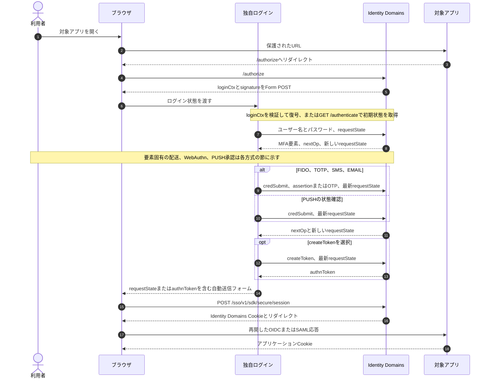
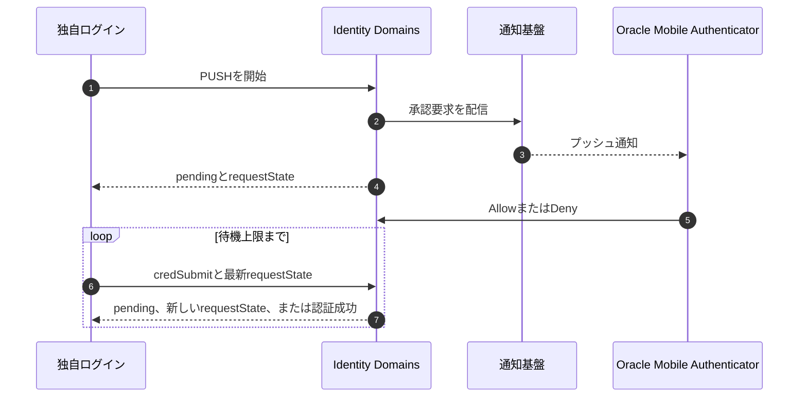
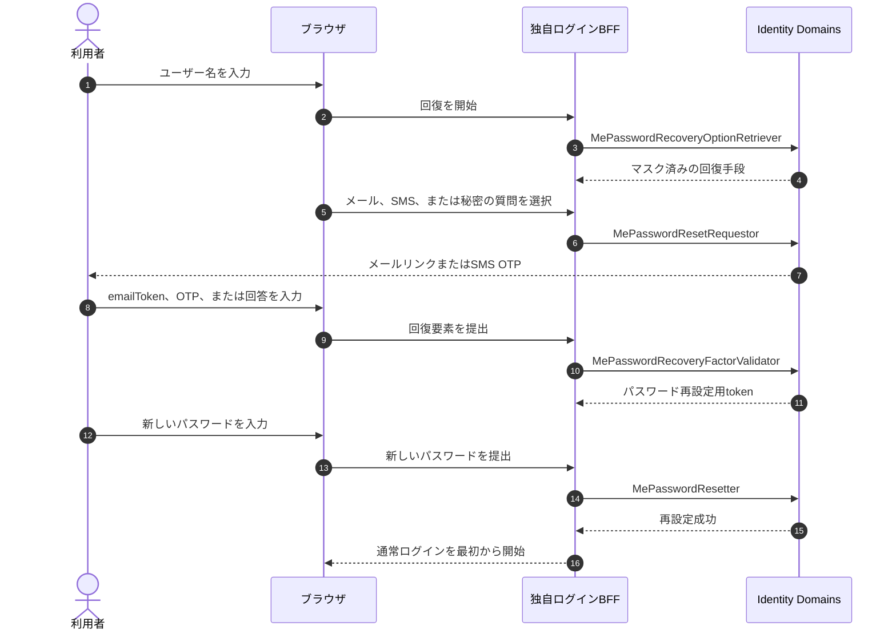

## このノートの対象

このノートは、OCI IAM Identity Domainsのログイン画面そのものを独自実装し、MFA、パスワード回復、認証要素のリセットを処理する通信を扱う。

[OracleのAuthenticate APIユースケース](https://docs.oracle.com/en-us/iaas/Content/Identity/api-getstarted/usingauthenticateapis.htm)は、このAPIをIdentity Domainsが使用する一連のログイン体験を独自開発するときだけ使うよう明記している。
一般のアプリケーションをIdentity DomainsへSSO統合するだけなら、対象アプリケーションはOIDCまたはSAMLを使い、通常はIdentity Domainsのホスト済みサインイン画面を利用する。

扱う認証順序は、ユーザー名とパスワードを第1要素とし、次のいずれかを第2要素とする構成である。

- FIDO Authenticator
- Oracle Mobile Authenticatorのプッシュ通知
- Oracle Mobile AuthenticatorまたはTOTP互換アプリのパスコード
- SMSで届くOTP
- メールで届くOTP

「モバイルオーセンティケーター」は一つの通信方式ではない。
[Oracleの認証要素の説明](https://docs.oracle.com/en-us/iaas/Content/Identity/mfa/configure-authentication-factors.htm)では、端末内でTOTPを生成するMobile App Passcodeと、オンラインで許可または拒否を返すMobile App Notificationを別の要素としている。
そのため、このノートでは両方を分けて扱う。

任意の時点で利用者が始める認証要素の新規登録と、FIDOを第1要素にするパスワードレス認証は対象外とする。
認証要素をリセットした後の再登録は、復旧フローの終端として扱う。
FIDOは登録時のオリジンと認証時のオリジンが関係するため、登録条件も認証フローの前提として記載する。

資料は2026年7月29日に確認した。
OracleのREST APIリファレンス、管理ガイド、Oracle公式サンプルの記述に差がある箇所は、実テナントでの確認事項として残す。

## APIの選択

Identity Domainsには、MFAを検証する名前の似た二つのAPIがある。
独自ログイン画面からIdentity DomainsのSSOセッションまで作る場合は、**Authenticate API**を使う。

| 比較項目           | Authenticate API                                          | On-Demand MFA API                                                  |
| ------------------ | --------------------------------------------------------- | ------------------------------------------------------------------ |
| 主なエンドポイント | `/sso/v1/sdk/authenticate`                                | `/mfa/v1/requests`                                                 |
| 目的               | ポリシー評価を含むログイン全体の状態遷移                  | 識別済みユーザーの認証要素を単独で検証                             |
| 認可               | `Signin`スコープを持つクライアントのAccess Token          | `Authenticator Client`または`MFA Client`スコープを持つAccess Token |
| 対応要素           | FIDO、PUSH、TOTP、SMS、EMAIL                              | PUSH、TOTP、SMS、EMAIL                                             |
| FIDO               | 対応                                                      | `method`の対応値に含まれない                                       |
| 成功後             | `authnToken`または`requestState`からSSOセッションを作れる | 要素検証の成功だけを返し、SSOセッションを作らない                  |
| 状態               | 応答の`nextOp`と`requestState`で進む                      | `requestId`と`requestState`で検証要求を追跡                        |

On-Demand MFA APIの対応要素は、[`POST /mfa/v1/requests`](https://docs.oracle.com/en/cloud/paas/iam-domains-rest-api/op-mfa-v1-requests-post.html)に列挙されている。
OTPの検証と再送は[`PATCH /mfa/v1/requests/{requestId}`](https://docs.oracle.com/en/cloud/paas/iam-domains-rest-api/op-mfa-v1-requests-requestid-patch.html)を使い、プッシュ承認は[`GET /mfa/v1/requests/{requestId}`](https://docs.oracle.com/en/cloud/paas/iam-domains-rest-api/op-mfa-v1-requests-requestid-get.html)で確認する。

したがって、On-Demand MFA APIをログインAPIとして置き換えることはできない。
アプリケーション独自のステップアップ認証に使う場合は、検証結果をアプリケーション側の操作やセッションへ結び付ける必要がある。

パスワード回復、パスワード変更、認証要素の削除には、これらのMFA検証APIではなく`/admin/v1`配下のSelf-Service APIまたは管理APIを使う。
これらのAPIが返す回復用状態をAuthenticate APIの`requestState`へ流用することはできない。

## ログインに登場する状態

このフローには、寿命と管理主体が異なる複数の状態がある。
これらを一つの「ログインセッション」として保存すると、期限切れ、ログアウト、MFA省略条件を正しく扱えない。

| 状態                     | 発行または管理する主体 | 用途                                                       | 認証済みセッションか       |
| ------------------------ | ---------------------- | ---------------------------------------------------------- | -------------------------- |
| `loginCtx`と`signature`  | Identity Domains       | `/authorize`から独自ログイン画面へ元の要求と初期状態を渡す | いいえ                     |
| Signin Access Token      | Identity Domains       | カスタムサインイン・クライアントがAuthenticate APIを呼ぶ   | いいえ                     |
| `requestState`           | Identity Domains       | 一回の認証トランザクションの現在位置を次の要求へ渡す       | いいえ                     |
| `authnToken`             | Identity Domains       | 完了した認証結果からSSOセッションを作る                    | いいえ                     |
| `trustToken`             | Identity Domains       | ブラウザを信頼済み端末として確立する                       | いいえ                     |
| `kmsiToken`              | Identity Domains       | Keep Me Signed Inを使って後続の再認証を補助する            | いいえ                     |
| Identity DomainsのCookie | Identity Domains       | Identity DomainsのSSOセッションを維持する                  | はい                       |
| OIDCまたはSAMLの応答     | Identity Domains       | 対象アプリケーションへ認証結果を渡す                       | セッションそのものではない |
| アプリケーションCookie   | 対象アプリケーション   | 対象アプリケーション内のログイン状態を維持する             | はい                       |

**`requestState`** は、Authenticate APIの状態機械を継続するための不透明な値である。
[Oracleの説明](https://docs.oracle.com/en-us/iaas/Content/Identity/api-getstarted/usingauthenticateapis.htm)は、各応答の`requestState`を次の要求に使うよう定めている。
クライアントは内容を解釈または再構築せず、常に直前の応答に含まれる値へ置き換える。

**`authnToken`** は、Oracleのユースケースでは現在のユーザー、セッション、要求情報を表すJWT形式の`id_token`と説明されている。
ただし、対象アプリケーションがOIDCフローで受け取るID Tokenとは役割が異なるため、SSOセッション作成へ渡す中間的な認証結果として区別する。
トークンの内容と交換例は、[[cloud/oracle/identity/identity-domains-token-samples|Identity Domainsで生成されるトークンサンプル]]にも整理している。

## 共通の通信フェーズ

### 管理側の事前設定

認証フローを開始する前に、Identity Domains側で次の条件を満たす。

1. 使用する認証要素を有効にする。
2. サインオン・ルールで追加要素を要求する。
3. テストユーザーが対象要素を登録する。
4. カスタムサインイン用のConfidential Applicationへ`Signin` AppRoleを付与する。
5. 独自ログイン画面のURL、CORS、エラーURLを構成する。
6. FIDOを使う場合は、独自ログイン画面のオリジンに対してFIDO資格情報を登録できるよう構成する。

[MFA設定手順](https://docs.oracle.com/en-us/iaas/Content/Identity/mfa/configure-multi-factor-authentication-settings.htm)は、管理者のロックアウトを避けるため、テスト用Identity Domainとテストユーザーを使い、検証中はEnrollmentをOptionalにするよう案内している。
SMSを含む要素の可否はIdentity Domainの種類によって異なるため、[Identity Domainの種類](https://docs.oracle.com/en-us/iaas/Content/Identity/sku/overview.htm)も確認する。
`Signin` AppRoleとエンドポイントの対応は、[Required AppRoles for APIs](https://docs.oracle.com/en-us/iaas/Content/Identity/api-getstarted/RequiredRolePerEndpointExt.htm)で確認する。

### ログインの開始

通常のSSO開始点では、利用者が対象アプリケーションを開き、対象アプリケーションがブラウザをIdentity Domainsの`/authorize`へ移動させる。
Identity Domainsは既定の画面を表示する代わりに、`loginCtx`と`signature`を独自ログイン画面へHTML Form POSTする。

独自ログイン画面は`loginCtx`を検証して復号し、その内容に対応するAuthenticate APIの状態から処理を始める。
`signature`を受け取っても検証せずに`loginCtx`を信頼するわけにはいかない。
公開ユースケースは復号手順を示す一方、現行の署名検証契約を十分に説明していないため、Oracleがサポートする検証方法を実装前に確認する（要確認）。

`/authorize`を起点としない検証では、カスタムサインイン・クライアントが次の要求で初期`requestState`を取得できる。

```http
GET /sso/v1/sdk/authenticate?appName=<application-name>
Authorization: Bearer <signin-access-token>
Accept: application/json
```

`appName`は任意だが、省略してよいという意味は「ポリシー評価が同じ」という意味ではない。
[`GET /sso/v1/sdk/authenticate`](https://docs.oracle.com/en/cloud/paas/iam-domains-rest-api/op-sso-v1-sdk-authenticate-get.html)の説明どおり、`appName`を指定すると対象アプリケーション固有のサインオン・ポリシーが評価される。

初期応答の代表形は次のとおりである。

```json
{
  "status": "success",
  "nextOp": ["credSubmit"],
  "nextAuthFactors": ["USERNAME_PASSWORD"],
  "USERNAME_PASSWORD": {
    "credentials": ["username", "password"]
  },
  "requestState": "<state-0>"
}
```

### ユーザー名とパスワード

独自ログイン画面は、応答の`nextOp`と`USERNAME_PASSWORD.credentials`に従って入力欄を表示する。
入力後、[`POST /sso/v1/sdk/authenticate`](https://docs.oracle.com/en/cloud/paas/iam-domains-rest-api/op-sso-v1-sdk-authenticate-post.html)へ資格情報と最新の`requestState`を送る。
GETだけでなく、すべてのAuthenticate API要求へ`Authorization: Bearer <signin-access-token>`を付ける。

```json
{
  "op": "credSubmit",
  "credentials": {
    "username": "<username>",
    "password": "<password>"
  },
  "requestState": "<state-0>"
}
```

この例はOracleの現行ユースケースに合わせて`authFactor`を省略しているが、公式サインイン・サンプルには`authFactor: "USERNAME_PASSWORD"`を送る実装もある。
実装では、初期応答が示す`nextAuthFactors`と`credentials`を契約として扱う。

Identity Domainsはユーザー、アプリケーション、サインオン・ポリシー、信頼済み端末などを評価する。
追加のMFAが不要な場合も、Identity Domainsは`authnToken`を返す経路と、`createSession`を含む`nextOp`と`requestState`を返す経路を取り得る。
MFAが必要な場合は、優先要素または選択可能な要素と新しい`requestState`を返す。

クライアントが次の画面を固定した順番で表示するわけではない。
`nextOp`、`nextAuthFactors`、要素ごとの`credentials`を毎回読み、Identity Domainsが許可した操作だけを提示する。

### バックアップ要素の選択

応答の`nextOp`に`getBackupFactors`がある場合、利用者は登録済みの別要素へ切り替えられる。

```json
{
  "op": "getBackupFactors",
  "requestState": "<latest-state>"
}
```

FIDOを含むフローでは、Oracle公式サンプルがトップレベルの`origin`も送っている。

```json
{
  "op": "getBackupFactors",
  "origin": "https://login.example.com",
  "requestState": "<latest-state>"
}
```

応答には、実際に登録済みの`nextAuthFactors`と、必要に応じて`enrolledDevices`の`deviceId`、表示名、優先要素が含まれる。
要素を選択した後は、応答が要求する`deviceId`などを`credentials`へ入れて`credSubmit`する。

`getBackupFactors`は登録済み要素と端末を列挙するだけであり、この要求自体はOTPやプッシュ通知を送らない。
SMS、EMAIL、PUSHでは、その後の`credSubmit`へ`authFactor`と`deviceId`を入れた要素選択要求が送信を開始する。
TOTPはサーバーからコードを送らないため、端末で生成した`otpCode`を選択要求と同時に送れる場合がある。

要素の切替時には、進行中のプッシュ・ポーリングを中止し、切替後の応答に含まれる新しい`requestState`だけを使う。
進行中のWebAuthn処理も止める場合は、`navigator.credentials.get()`へ`AbortSignal`を渡し、切替時に対応する`AbortController`を呼ぶ。

### 認証後のSSOセッション

どのMFA要素を使っても、認証成功後のセッション確立は共通である。

Identity Domainsの最終応答が許可する`nextOp`から、`createSession`または`createToken`を選ぶ。
`createSession`を選ぶ場合は最新の`requestState`をセッション作成へ渡し、`createToken`を選ぶ場合は次の要求で`authnToken`を取得する。

```json
{
  "op": "createToken",
  "requestState": "<latest-state>"
}
```

ブラウザは、選択した経路の`requestState`または`authnToken`をフォームに入れ、`/sso/v1/sdk/secure/session`へトップレベルのPOSTを行う。
Oracleのカスタムサインイン・ユースケースは、secure sessionのフォームへSignin Access Tokenを`authorization`として加えるよう求めている。
一方、RESTエンドポイントのスキーマは`authorization`をoptionalと記載しているため、使用する経路と実テナントの要求を確認する（要確認）。

```http
POST /sso/v1/sdk/secure/session
Content-Type: multipart/form-data

authnToken=<authentication-token>
authorization=<signin-access-token>
```

信頼済み端末を使う場合は、`trustToken`も同じフォームへ加える。

```text
trustToken=<trust-token>
```

KMSIの詳細ユースケースは、Keep Me Signed Inを使う場合に`kmsiToken`もフォームへ加えるよう求めている。
ただし、現行RESTスキーマは`kmsiToken`自体を掲載していないため、KMSIを採用するテナントで確認する（要確認）。

[`POST /sso/v1/sdk/secure/session`](https://docs.oracle.com/en/cloud/paas/iam-domains-rest-api/op-sso-v1-sdk-secure-session-post.html)は、成功時に自動送信用HTMLまたは3xxリダイレクトを返す。
このブラウザ通信によってIdentity DomainsのCookieがブラウザへ設定され、元のOIDCまたはSAMLフローが再開する。

セッション作成をバックエンドのHTTPクライアントだけで呼ぶと、Identity DomainsのCookieは利用者のブラウザではなくバックエンド側へ設定される。
そのため、最終セッション作成は利用者のブラウザを通す必要がある。

旧`/sso/v1/sdk/session`は[REST APIリファレンスで19.2.1以降非推奨](https://docs.oracle.com/en/cloud/paas/iam-domains-rest-api/op-sso-v1-sdk-session-post.html)である。
Oracle公式サンプルの一部は旧エンドポイントを使うため、新規実装では`/secure/session`のフォーム項目と戻り値に合わせて移行する。
旧エンドポイントには`authorization`項目がないため、URLだけを置き換える移行ではない。

対象アプリケーションは再開したOIDCまたはSAML応答を検証し、最後にアプリケーション自身のCookieを作る。
Identity DomainsのSSO CookieとアプリケーションCookieは、期限もログアウト処理も別に管理する。



## FIDO Authenticator

### 通信フェーズ

FIDO認証は、Authenticate APIだけで完結しない。
Identity Domainsが発行するチャレンジをブラウザのWebAuthn APIへ渡し、Authenticatorが作った署名をAuthenticate APIへ戻す。

1. パスワード認証後、Identity Domainsが`FIDO_AUTHENTICATOR`を優先要素として返すか、利用者がバックアップ要素から登録済みFIDO端末を選ぶ。
2. 要素を明示的に選ぶ場合、独自ログイン画面は`authFactor`と`deviceId`を送る。
3. Oracle公式サンプルのモデルでは、Identity Domainsが新しい`requestState`と`FIDO_AUTHENTICATOR.fidoData`を返す。
4. ブラウザは`fidoData`を`PublicKeyCredentialRequestOptions`へ変換する。
5. ブラウザは`navigator.credentials.get()`を呼び、セキュリティキー、Windows Hello、Touch IDなどへ利用者確認を求める。
6. ブラウザはAuthenticator assertionをJSON化し、最新の`requestState`とともにAuthenticate APIへ返す。
7. Identity Domainsが署名とチャレンジを検証し、次の`nextOp`と状態を返す。
8. `createToken`を選んだ場合は、追加のAuthenticate API要求で`authnToken`を取得する。

要素選択要求の代表形は次のとおりである。

```json
{
  "op": "credSubmit",
  "authFactor": "FIDO_AUTHENTICATOR",
  "credentials": {
    "deviceId": "<registered-device-id>"
  },
  "requestState": "<state-before-fido>"
}
```

`fidoData`には、少なくともチャレンジ、RP ID、許可する資格情報、タイムアウト、User Verification条件が含まれ得る。
公開RESTスキーマは完全な形を定義していないため、次の形は固定契約ではなく、Oracle公式サンプルから読み取れる変換モデルである。

```javascript
const options = Object.fromEntries(fidoData.map(({ name, value }) => [name, value]))

const publicKey = {
  challenge: toBuffer(options.challenge),
  allowCredentials: toCredentialDescriptors(options.allowCredentials),
  rpId: options.rpId,
  timeout: options.timeout,
  userVerification: options.authSelectionUserVerification,
}

const credential = await navigator.credentials.get({ publicKey })
```

Authenticator assertionの提出は次の形になる。

```json
{
  "op": "credSubmit",
  "origin": "https://login.example.com",
  "credentials": {
    "fidoAssertion": "<serialized-public-key-credential>"
  },
  "requestState": "<state-with-fido-challenge>"
}
```

シリアライズしたcredentialには`id`、`rawId`、`type`があり、`credential.response`には`clientDataJSON`、`authenticatorData`、`signature`、nullableな`userHandle`がある。
バイナリ項目の符号化は、実テナントの`fidoData`とOracleが期待する形式を確認して実装する。

[Oracle公式のカスタムサインイン・サンプル](https://github.com/oracle-samples/idm-samples/tree/master/idcs-authn-api-signin-app#configure-the-custom-sign-in-application-for-fido-integration)は、独自ログイン画面の現在のオリジンをIdentity Domainsへ渡し、そのログイン・ドメイン用にFIDO資格情報を登録するよう説明している。
実際の変換とassertion生成は、公式サンプルの[`WebAuthn.js`](https://github.com/oracle-samples/idm-samples/blob/master/idcs-authn-api-signin-app/public/js/WebAuthn.js)で確認できる。

### オリジンとRP ID

WebAuthn資格情報は、任意のログイン画面から使える共通鍵ではない。
[WebAuthn Level 3](https://www.w3.org/TR/webauthn-3/)は、WebAuthn APIをSecure Contextに限定し、assertionへ要求元オリジンを含め、資格情報をRP IDへスコープする。

したがって、本番の独自ログイン画面には有効なHTTPSが必要である。
`http://localhost`には標準上の開発用例外があるが、任意ホストのHTTPを許可する根拠にはならない。
RP IDは呼出元オリジンのeffective domainと同じか、そのregistrable domain suffixである必要がある。
Identity Domains標準画面のホストで登録したFIDO資格情報を、RP ID関係のない`login.example.com`からそのまま使うことはできない。
カスタム・ドメインでの登録、RP ID、許可オリジンを認証前に設計する。

WebAuthn Level 3にはRelated Originsもあるが、Identity Domainsのカスタムサインインがその機能へ対応することは公開資料から確認できない（要確認）。

### 失敗時の扱い

ブラウザ側では、利用者の取消、タイムアウト、一致する資格情報の不在などが`NotAllowedError`へまとめられることがある。
RP IDとオリジンの不整合は`SecurityError`となり、入力オプションの形式不正は`TypeError`となり得る。

Identity Domains側では、期限切れの`requestState`と無効な登録端末が失敗要因となる。
WebAuthnの検証モデルでは、要求時と異なるチャレンジ、改変されたassertion、RP IDまたはオリジンの不一致、署名不一致を受け入れない。
公開RESTリファレンスはFIDO固有のエラー対応を十分に列挙していないため、`status`、`cause.code`、`nextOp`、新しい`requestState`の有無を見て復旧画面を決める。

Oracle公式サンプルのREADMEには、登録用attestationを認証例として示した箇所と、実コードの`fidoData`形式に一致しない箇所がある。
サンプルは学習用であり、現行テナントの応答からAccess Token、`requestState`、チャレンジ、assertion、端末識別子、ユーザー識別子を除去して契約テストを作る必要がある。

## Oracle Mobile Authenticator

### プッシュ通知

プッシュ通知では、Identity Domains、通知基盤、Oracle Mobile Authenticator、独自ログイン画面の通信が並行する。
利用者がアプリでAllowまたはDenyを選ぶまで、独自ログイン画面はAuthenticate APIで状態を確認する。

1. パスワード認証またはバックアップ要素の選択によって、`PUSH`を開始する。
2. Identity Domainsがモバイル通知基盤を通じて登録済み端末へ承認要求を送る。
3. Authenticate APIは`status: "pending"`と新しい`requestState`を返す。
4. 利用者がOracle Mobile AuthenticatorでAllowまたはDenyを選ぶ。
5. 独自ログイン画面は最新の`requestState`で`credSubmit`を繰り返す。
6. 承認済みなら`authnToken`が返り、未処理なら新しいpending状態が返る。
7. 拒否、期限切れ、またはクライアント側の待機上限への到達時は、失敗画面またはバックアップ要素選択へ移る。

優先要素がPUSHの場合、パスワード提出直後に通知が開始されることがある。
Oracleの[ユーザー名、パスワード、MFAの例](https://docs.oracle.com/en-us/iaas/Content/Identity/api-getstarted/usingauthenticateapis.htm)は、pending応答を次の要求で確認する形を示している。

```json
{
  "op": "credSubmit",
  "requestState": "<pending-push-state>"
}
```

バックアップ要素としてPUSHを選ぶ場合は、最初の要求に要素と端末を含める。

```json
{
  "op": "credSubmit",
  "authFactor": "PUSH",
  "credentials": {
    "deviceId": "<registered-device-id>"
  },
  "requestState": "<state-before-push>"
}
```

ポーリング間隔と総待機時間はクライアント側で上限を設ける。
Oracle公式Postman説明と公式サインイン・サンプルでは間隔が一致しないため、特定の秒数をIdentity Domainsの契約として固定しない（要確認）。

PUSHのpendingは失敗ではない。
たとえば`AUTH-1108`は公式例で承認待ちを示すため、HTTPステータスだけでなく応答本文の`status`と`cause.code`を状態遷移へ対応させる。



### モバイル・パスコード

TOTPでは、Oracle Mobile Authenticatorまたは互換アプリが共有秘密と現在時刻から端末内でコードを生成する。
認証時にIdentity Domainsから端末へ通知を送る通信はなく、端末がオフラインでもコードを生成できる。

1. パスワード認証後、Identity Domainsが`TOTP.credentials: ["otpCode"]`と新しい`requestState`を返す。
2. 利用者がモバイルアプリに表示されたコードを独自ログイン画面へ入力する。
3. 独自ログイン画面が`otpCode`と最新の`requestState`を送る。
4. Identity Domainsが共有秘密と許容時刻幅を使ってコードを検証する。
5. 成功すると`authnToken`またはセッション作成可能な状態を返す。

```json
{
  "op": "credSubmit",
  "credentials": {
    "otpCode": "<totp-code>"
  },
  "requestState": "<totp-state>"
}
```

この例は、優先要素としてTOTPが選択済みの場合の形である。
バックアップ要素から特定のTOTP端末を選ぶ場合、Oracle公式サンプルは要素、端末、コードを一度に送っている。

```json
{
  "op": "credSubmit",
  "authFactor": "TOTP",
  "credentials": {
    "deviceId": "<registered-device-id>",
    "otpCode": "<totp-code>"
  },
  "requestState": "<state-before-totp-selection>"
}
```

固定したJSONを使うのではなく、その応答の`nextAuthFactors`と`credentials`に従う。

[Mobile OTPの設定](https://docs.oracle.com/en-us/iaas/Content/Identity/mfa/configure-mobile-otp-and-notifications.htm)では、コード生成間隔と許容する端末時計のずれを管理側で設定する。
連続してコードが不正になる場合は、単なる再入力だけでなく端末時刻の同期も案内する。

TOTPにはSMSやメールの`resendCode`に相当する通信がない。
利用者は次の時間窓でモバイルアプリが生成する新しいコードを使う。

## SMS通知

SMSでは、Identity Domainsが登録済み電話番号へOTPを送り、独自ログイン画面が利用者の入力をIdentity Domainsへ戻す。

1. パスワード認証またはSMS要素の選択によって、Identity DomainsがSMS送信を開始する。
2. Identity DomainsがSMS配信事業者を経由して登録済み電話番号へOTPを送る。
3. Authenticate APIは`SMS.credentials: ["otpCode"]`、`credSubmit`、必要に応じて`resendCode`、新しい`requestState`を返す。
4. 利用者がSMSのOTPを独自ログイン画面へ入力する。
5. 独自ログイン画面がOTPと最新の`requestState`を送る。
6. 成功すると`authnToken`またはセッション作成可能な状態を返す。

```json
{
  "op": "credSubmit",
  "credentials": {
    "otpCode": "<sms-otp>"
  },
  "requestState": "<sms-state>"
}
```

この例は、優先要素としてSMSが選択され、OTP送信後の入力を検証する形である。
バックアップ要素からSMSを選ぶ場合は、先に登録済み端末を指定して配送を開始する。

```json
{
  "op": "credSubmit",
  "authFactor": "SMS",
  "credentials": {
    "deviceId": "<registered-device-id>"
  },
  "requestState": "<state-before-sms-selection>"
}
```

Identity DomainsがOTP入力用の新しい`requestState`を返した後、その状態と`otpCode`を使って先の検証要求を送る。

利用者が再送を選べるのは、応答の`nextOp`に`resendCode`がある場合だけである。

```json
{
  "op": "resendCode",
  "requestState": "<latest-sms-state>"
}
```

再送応答にも新しい`requestState`が含まれるため、先に表示したOTP入力画面の状態を置き換える。
古いOTPがいつ無効になるか、再送の待機時間、配信事業者側の遅延上限は公開契約から確認できない（要確認）。

電話番号はIdentity Domainsが返すマスク済みの`displayName`だけを表示し、クライアントがユーザー属性から送信先を組み立てない。
送信先の変更はMFA登録情報の変更として別フローで扱う。

## メールOTP

メールOTPのAPI形状はSMSとほぼ同じだが、送信先と配送経路が異なる。
[認証要素の説明](https://docs.oracle.com/en-us/iaas/Content/Identity/mfa/configure-authentication-factors.htm)では、Identity Domainsがユーザーのプライマリ・メールアドレスへOTPを送る。

1. パスワード認証またはEMAIL要素の選択によって、Identity Domainsがメール送信を開始する。
2. Identity Domainsがメール配送基盤を通じてプライマリ・メールアドレスへOTPを送る。
3. Authenticate APIは`EMAIL.credentials: ["otpCode"]`、`credSubmit`、必要に応じて`resendCode`、新しい`requestState`を返す。
4. 利用者がメールのOTPを独自ログイン画面へ入力する。
5. 独自ログイン画面がOTPと最新の`requestState`を送る。
6. 成功すると`authnToken`またはセッション作成可能な状態を返す。

```json
{
  "op": "credSubmit",
  "credentials": {
    "otpCode": "<email-otp>"
  },
  "requestState": "<email-state>"
}
```

この例は、優先要素としてEMAILが選択され、OTP送信後の入力を検証する形である。
バックアップ要素からEMAILを選ぶ場合は、先に登録済みの配送先を指定する。

```json
{
  "op": "credSubmit",
  "authFactor": "EMAIL",
  "credentials": {
    "deviceId": "<registered-device-id>"
  },
  "requestState": "<state-before-email-selection>"
}
```

Identity DomainsがOTP入力用の新しい`requestState`を返した後、その状態と`otpCode`を使って先の検証要求を送る。

再送はSMSと同じ`resendCode`を使う。
メールアドレスはIdentity Domainsが返したマスク済みの`displayName`を表示し、独自ログイン画面へ完全なアドレスを不要に露出させない。

メールの遅延や迷惑メール分類は認証APIの失敗とは限らない。
UIでは再送待機時間、別要素への切替、サポート導線を分けて表示する。

## 方式別の差

| 方式     | Identity Domainsから利用者側への通信 | 利用者の操作                              | 独自ログイン画面の待機モデル | 再送                                                 |
| -------- | ------------------------------------ | ----------------------------------------- | ---------------------------- | ---------------------------------------------------- |
| FIDO     | チャレンジをREST応答でブラウザへ返す | Authenticatorを選び、タッチまたは生体確認 | WebAuthn Promiseを待つ       | 再送ではなく新しいceremonyを開始                     |
| OMA PUSH | 通知基盤を通じてOMAへ承認要求        | AllowまたはDeny                           | Authenticate APIをポーリング | `resendCode`はなく、新規通知の制限は実テナントで確認 |
| OMA TOTP | 認証時の端末向け通信なし             | 端末内生成コードを入力                    | 1回のコード提出              | なし                                                 |
| SMS      | SMS配信事業者を通じてOTPを送信       | SMSのコードを入力                         | 配信と入力を待つ             | `nextOp`にある場合は`resendCode`                     |
| EMAIL    | メール配送基盤を通じてOTPを送信      | メールのコードを入力                      | 配送と入力を待つ             | `nextOp`にある場合は`resendCode`                     |

FIDOのassertionはブラウザのオリジンへ暗号学的に結び付き、RP IDとの関係もブラウザが強制する。
PUSHだけは、利用者の操作結果が別端末からIdentity Domainsへ届くため、独自ログイン画面による状態確認が必要になる。
TOTP、SMS、EMAILは同じ`otpCode`入力に見えるが、TOTPにはサーバーからの送信と再送がない。

## パスワード変更とパスワード回復

新しいパスワードを設定する処理には、現在のパスワードを知っている変更、パスワードを忘れた利用者の回復、管理者によるリセットがある。
これらは本人または管理者の権限を証明する方法が異なるため、一つのエンドポイントや同じ画面状態へまとめない。

| ケース                         | 操作を許可する根拠                     | 主なエンドポイント                          | 完了後                         |
| ------------------------------ | -------------------------------------- | ------------------------------------------- | ------------------------------ |
| 認証済み利用者による変更       | 現在のパスワードと利用者のAccess Token | `PUT /admin/v1/MePasswordChanger`           | 必要に応じて再ログイン         |
| 初回、期限切れ、一時パスワード | 旧パスワードまたは一時パスワード       | `POST /admin/v1/MePasswordMustChanger`      | 通常の認証フローを継続         |
| パスワードを忘れた利用者       | 回復メール、SMS、または秘密の質問      | `MePasswordRecovery*`と`MePasswordResetter` | 新しいログインを開始           |
| 管理者によるリセット           | 管理ロールと組織側の本人確認手続き     | `PUT /admin/v1/UserPasswordResetter/{id}`   | 通知または一時パスワードで復旧 |

### 認証済み利用者による変更

現在のパスワードを知っている利用者は、[`PUT /admin/v1/MePasswordChanger`](https://docs.oracle.com/en/cloud/paas/iam-domains-rest-api/op-admin-v1-mepasswordchanger-put.html)へ旧パスワードと新しいパスワードを送る。
このエンドポイントはパスワードを忘れた場合の回復には使えない。

```json
{
  "schemas": ["urn:ietf:params:scim:schemas:oracle:idcs:MePasswordChanger"],
  "oldPassword": "<current-password>",
  "password": "<new-password>"
}
```

独自画面では、保存済みの利用者セッションがあるだけで変更を許可せず、実行直前に現在のパスワードまたはMFAで再認証する。
これはOracleの要求ペイロードにMFAが必須という意味ではなく、セッションを盗んだ第三者による資格情報変更を抑えるための設計判断である。

初回ログイン、期限切れ、一時パスワードなど、Identity Domainsが変更を強制する場合は[`POST /admin/v1/MePasswordMustChanger`](https://docs.oracle.com/en/cloud/paas/iam-domains-rest-api/op-admin-v1-mepasswordmustchanger-post.html)を使う。
この処理も旧パスワードまたは一時パスワードを知っていることを前提とする。

### パスワードを忘れた場合

パスワード回復はAuthenticate APIの途中状態ではなく、回復要素の検証結果をパスワード再設定用`token`へ交換する独立したトランザクションである。
回復成功時にもIdentity DomainsのSSOセッションは作成されないため、完了後は通常のログインを最初から開始する。

パスワード回復で使うメールは、MFAのEMAIL要素が送るOTPとは異なる。
メール回復では、通知リンクから得た`emailToken`をPassword Recovery APIで検証する。

| 回復状態                     | 発行または管理する主体 | 用途                                           | 認証済みセッションか |
| ---------------------------- | ---------------------- | ---------------------------------------------- | -------------------- |
| `recoveryFlowId`             | 独自ログインBFF        | ブラウザとサーバー側の回復状態を対応付ける     | いいえ               |
| SMSの`deviceId`と`requestId` | Identity Domains       | SMS送信要求とOTP検証を対応付ける               | いいえ               |
| メールの`emailToken`         | Identity Domains       | 通知リンクを受け取ったことを検証する           | いいえ               |
| パスワード再設定用`token`    | Identity Domains       | 回復要素の検証結果を新しいパスワード設定へ渡す | いいえ               |



#### 回復手段の取得

最初に[`POST /admin/v1/MePasswordRecoveryOptionRetriever`](https://docs.oracle.com/en/cloud/paas/iam-domains-rest-api/op-admin-v1-mepasswordrecoveryoptionretriever-post.html)へユーザー名を送る。
応答の`options`には、構成済みの`email`、`sms`、`secquestions`がマスクされた値とともに含まれる。

```json
{
  "schemas": ["urn:ietf:params:scim:schemas:oracle:idcs:MePasswordRecoveryOptionRetriever"],
  "userName": "<user-name>"
}
```

FIDOとOracle Mobile Authenticatorは、このPassword Recovery APIが扱う回復手段ではない。
これらの端末だけを失った場合は、残っている回復手段または管理者支援フローで本人を確認する。

#### 回復通知の開始

利用者が回復手段を選んだ後、BFFは[`POST /admin/v1/MePasswordResetRequestor`](https://docs.oracle.com/en/cloud/paas/iam-domains-rest-api/op-admin-v1-mepasswordresetrequestor-post.html)を呼ぶ。
`notificationType`には`email`、`sms`、`secquestions`のいずれかを指定する。

メールでは回復リンクまたはトークンが送信される。
SMSではOTPが送信され、応答の`deviceId`と`requestId`を次の検証へ引き継ぐ。
秘密の質問では、応答された質問に対する回答を次の検証へ送る。

`notificationRedirectUrl`で独自回復画面へ戻し、`returnUrl`で回復成功後の移動先を指定できる。
これらのURLはIdentity DomainsのSettingsにある`allowedNotificationRedirectUrls`と`allowedForgotPasswordFlowReturnUrls`へ事前登録する。
許可URLの属性は[`GET /admin/v1/Settings/{id}`](https://docs.oracle.com/en/cloud/paas/iam-domains-rest-api/op-admin-v1-settings-id-get.html)で確認できる。

#### 回復要素の検証

利用者が受け取った値を、[`POST /admin/v1/MePasswordRecoveryFactorValidator`](https://docs.oracle.com/en/cloud/paas/iam-domains-rest-api/op-admin-v1-mepasswordrecoveryfactorvalidator-post.html)へ送る。
回復手段ごとに必要な値が異なる。

- メール：`type: "email"`と`emailToken`
- SMS：`type: "sms"`、`userName`、`deviceId`、`requestId`、`otpCode`
- 秘密の質問：`type: "secquestions"`、`userName`、質問IDと回答

検証に成功すると、応答の読み取り専用属性`token`にパスワード再設定用トークンが返る。
この`token`は`authnToken`、Signin Access Token、Authenticate APIの`requestState`のいずれでもない。

#### 新しいパスワードの設定

BFFは[`POST /admin/v1/MePasswordResetter`](https://docs.oracle.com/en/cloud/paas/iam-domains-rest-api/op-admin-v1-mepasswordresetter-post.html)へ、直前に取得した`token`と新しいパスワードを送る。

```json
{
  "schemas": ["urn:ietf:params:scim:schemas:oracle:idcs:MePasswordResetter"],
  "token": "<password-reset-token>",
  "password": "<new-password>"
}
```

成功後は回復トランザクションを使用済みにし、`token`、`deviceId`、`requestId`をサーバー側ストアから削除する。
以前のAuthenticate APIの`requestState`を再利用せず、新しい`/authorize`または`GET /sso/v1/sdk/authenticate`からログインを始める。

#### 独自画面で保持する回復状態

ブラウザへは推測困難な`recoveryFlowId`だけを渡し、次の値を短命なBFF側ストアへ関連付ける。
これはOracleの必須ペイロードではなく、回復用の秘密をブラウザへ残さないための設計モデルである。

- 現在の回復フェーズ
- 選択した回復手段
- SMSの`deviceId`と`requestId`
- パスワード再設定用`token`
- 有効期限と試行回数
- CSRF対策用の値
- 使用済みまたは中止済みの状態

クライアント・シークレット、AppRole付きAccess Token、回復用`token`はブラウザへ渡さない。
パスワード、OTP、`emailToken`、秘密の質問の回答、回復用`token`をURL、ログ、解析イベント、`localStorage`へ記録しない。

外向きの応答は、ユーザーの存在と回復手段の有無にかかわらず同じ文面へそろえる。
ユーザー名と送信元IPなどを使って開始、再送、検証の回数を制限し、ユーザー列挙とOTP試行を抑える。

`userFlowControlledByExternalClient: true`を使うと、通知を経由せず外部クライアントが回復フローを制御できる。
公開セルフサービスで安易に使うと、Identity Domainsが提供する通知経路を迂回するため、強い外部本人確認を完了したConfidential Application内に限定する。

パスワード回復を呼ぶConfidential Applicationには、必要なエンドポイントだけを許可する`Forgot Password`と`Reset Password` AppRoleを割り当てる。
エンドポイントとAppRoleの対応は[AppRole Permissions](https://docs.oracle.com/en-us/iaas/Content/Identity/api-getstarted/RequiredRolePerEndpointExt.htm)で確認する。

### 管理者によるパスワードリセット

管理者が利用者のパスワードを直接変更するAPIと、ランダム値を使ってリセットするAPIは分かれている。

- [`PUT /admin/v1/UserPasswordChanger/{id}`](https://docs.oracle.com/en/cloud/paas/iam-domains-rest-api/op-admin-v1-userpasswordchanger-id-put.html)：管理者が既知の値を設定する
- [`PUT /admin/v1/UserPasswordResetter/{id}`](https://docs.oracle.com/en/cloud/paas/iam-domains-rest-api/op-admin-v1-userpasswordresetter-id-put.html)：ランダム値と通知を使ってリセットする

通常のヘルプデスク運用では`UserPasswordResetter`を優先し、管理者が利用者の恒久パスワードを知る状態を避ける。
メールを使えない場合は一時パスワードを別の安全な経路で渡し、次回ログイン時に変更させる。

管理APIを呼べることは、ヘルプデスクが本人確認を完了したことを意味しない。
組織側の本人確認、承認、監査記録を完了した後で、管理用Confidential Applicationまたは管理者セッションから実行する。

## 認証要素のリセットと再登録

認証要素のリセットは、Identity Domainsが保持するFIDO公開鍵、モバイル端末、SMS、メールなどの登録を削除する操作である。
すでに成立しているSSOセッションやアプリケーション・セッションを終了する操作ではないため、端末紛失や侵害対応では両方を別工程として実行する。

| 操作者と範囲                 | 本人確認の前提                         | エンドポイント                                  | 主な用途                           |
| ---------------------------- | -------------------------------------- | ----------------------------------------------- | ---------------------------------- |
| 利用者が一つの端末を削除     | ログイン済みで、直前に再認証する       | `GET`、`DELETE /admin/v1/MyDevices/{id}`        | 古いスマートフォンやパスキーの削除 |
| 利用者が自分の全要素を削除   | 有効な利用者セッションが残っている     | `POST /admin/v1/MyAuthenticationFactorsRemover` | 自己管理による全MFAリセット        |
| 管理者が利用者の全要素を削除 | 組織側の本人確認と管理権限を持っている | `POST /admin/v1/AuthenticationFactorsRemover`   | 全要素を失った利用者の復旧         |

### 利用者による個別デバイス登録の削除

利用者がまだログインできる場合は、[`GET /admin/v1/MyDevices`](https://docs.oracle.com/en/cloud/paas/iam-domains-rest-api/op-admin-v1-mydevices-get.html)で自分の登録端末を取得し、[`DELETE /admin/v1/MyDevices/{id}`](https://docs.oracle.com/en/cloud/paas/iam-domains-rest-api/op-admin-v1-mydevices-id-delete.html)で対象を削除する。
`MyDevices`の`authenticationFactors.type`には、`EMAIL`、`SMS`、`TOTP`、`PUSH`、`FIDO_AUTHENTICATOR`などが定義されている。

独自画面は表示名だけで対象を決めず、端末ID、要素種別、登録状態を表示して利用者に確認させる。
削除直前には現在のパスワードまたは残っているMFA要素で再認証する。

Oracle Mobile Authenticatorの一つの端末登録にPUSHとTOTPが含まれる場合、端末を削除すると両方を失う可能性がある。
画面は「プッシュ通知だけを削除する」と誤解させず、その端末に結び付いた要素をまとめて示す。

FIDOパスキーは`FIDO_AUTHENTICATOR`を含む端末登録として削除する。
Identity Domains側の公開鍵登録を削除すると、そのパスキーはIdentity Domainsの認証へ使えなくなる。
端末またはパスワード管理サービス側に残るパスキーの表示はIdentity Domainsの管理外であるため、必要なら利用者が保存先でも削除する。

[My Profileでの要素削除手順](https://docs.oracle.com/en-us/iaas/Content/Identity/mfa/remove-2-step-verification-method.htm)は、最後の認証要素を利用者自身が削除できないと説明している。
独自画面でも新しい要素を先に登録させ、少なくとも一つの有効な要素を残してから古い要素を削除する。

### 全要素のリセット

ログイン済みの利用者が自分の要素をリセットする場合は、[`POST /admin/v1/MyAuthenticationFactorsRemover`](https://docs.oracle.com/en/cloud/paas/iam-domains-rest-api/op-admin-v1-myauthenticationfactorsremover-post.html)を使う。
最後の要素を失ってログインできない場合は、このSelf-Service APIを呼べないため、管理者支援へ切り替える。

管理者は、組織側の本人確認を完了した後で[`POST /admin/v1/AuthenticationFactorsRemover`](https://docs.oracle.com/en/cloud/paas/iam-domains-rest-api/op-admin-v1-authenticationfactorsremover-post.html)を呼ぶ。

```json
{
  "schemas": ["urn:ietf:params:scim:schemas:oracle:idcs:AuthenticationFactorsRemover"],
  "user": {
    "value": "<user-id>"
  },
  "type": "MFA"
}
```

`type`の現行RESTスキーマには`MFA`、`ACCOUNTRECOVERY`、`ALL`がある。
MFA要素だけを削除するなら`MFA`、回復要素だけなら`ACCOUNTRECOVERY`、両方を削除する場合だけ`ALL`を明示する。
`type`を省略すると意図した削除範囲をコードから判断できないため、独自実装では必ず指定する。

[管理コンソールのReset factors](https://docs.oracle.com/en-us/iaas/Content/Identity/users/reset-authentication-factors-user-accounts.htm)は、登録済みの検証要素をすべて削除し、次回ログイン時に2段階認証とアカウント回復の登録を求める。
現在の公開REST仕様では、管理者が任意の利用者のFIDOパスキーやOMA端末を一件だけ削除する管理用エンドポイントを確認できない。
個別削除は利用者の`MyDevices`、管理者支援は`AuthenticationFactorsRemover`による全要素リセットを基本にする。

### リセット後の再登録

MFAが必須のサインオン・ポリシーでは、要素をすべて削除した利用者は次回ログイン時に再登録を求められる。
独自ログイン画面は、Authenticate APIが返す登録状態に従うか、登録専用画面へ移す。

Oracle Mobile Authenticator、SMS、メールのSelf-Service登録には、[`POST /admin/v1/MyAuthenticationFactorEnroller`](https://docs.oracle.com/en/cloud/paas/iam-domains-rest-api/op-admin-v1-myauthenticationfactorenroller-post.html)と[`POST /admin/v1/MyAuthenticationFactorValidator`](https://docs.oracle.com/en/cloud/paas/iam-domains-rest-api/op-admin-v1-myauthenticationfactorvalidator-post.html)を使える。
登録開始時に発行された端末ID、要求ID、QRコードなどを保持し、PUSH承認またはOTP検証が成功してから登録済みとして扱う。

FIDOの再登録では、認証時の`navigator.credentials.get()`ではなく、新しい公開鍵資格情報を作る`navigator.credentials.create()`を使う。
ただし、現行の公開RESTリファレンスは、完全に独自実装するFIDO登録用WebAuthnペイロードを十分に定義していない。
Identity Domainsが返す登録用チャレンジを実テナントで確認して処理するか、[My ProfileのFIDO登録画面](https://docs.oracle.com/en-us/iaas/Content/Identity/mfa/Using-fido-authentication.htm)へ移す。

## セッション管理

### Signin Access Token

Authenticate APIを呼ぶAccess Tokenは、利用者のAccess Tokenではなく、カスタムサインイン・クライアントのアプリケーション・トークンである。
クライアント資格情報を使う場合、クライアント・シークレットはサーバー側だけに置き、Access Tokenの期限切れ時には新しいトークンを取得する。

Oracleのカスタムサインイン例は、復号した`loginCtx`とAccess Tokenをブラウザへ渡し、JavaScriptからIdentity Domainsへ直接AJAX要求を行う構成も示している。
この構成ではSignin Access Token、ユーザーのパスワード、`requestState`がブラウザJavaScriptの処理対象になる。

設計上の推奨として、クライアント・シークレットとAuthenticate API呼出しは可能な範囲でBackend for Frontendへ集約する。
一方、`/secure/session`はブラウザへIdentity DomainsのCookieを設定する必要があり、Oracleの詳細ユースケースでは`authorization`もフォーム項目として要求する。
現行RESTスキーマはこの項目をoptionalと記載しており、両資料は一致していない。
したがって、Signin Access Tokenをブラウザから完全に隠せるとは公開資料だけでは断定できない（要確認）。

少なくとも、Signin Access Tokenを`localStorage`や`sessionStorage`へ保存せず、URL、アクセスログ、解析イベント、エラー画面へ出さない。
最終フォームへ含める場合は短い有効期間と最小の権限を使い、第三者スクリプトを置かないログイン画面で一時的に扱う。

### 認証トランザクション

独自ログイン側では、ブラウザへランダムなトランザクションIDだけを渡し、次の値を短命なサーバー側ストアへ関連付ける構成が考えられる。
これはOracleの必須契約ではなく、状態の混線と漏えいを減らすための設計モデルである。

- 最新の`requestState`
- 元の`loginCtx`と検証済みの戻り先
- 選択中の要素
- PUSHポーリングの開始時刻と回数
- WebAuthn ceremonyの進行状態
- CSRF対策用の値
- `authnToken`、`trustToken`、`kmsiToken`

同じトランザクションへの要求は直列化し、遅れて返った古い応答で最新の`requestState`を上書きしない。
二重クリック、複数タブ、要素切替後も続くPUSHポーリングは、古い状態を再利用する原因になる。

`requestState`、`authnToken`、FIDO assertion、OTPをアプリケーション・ログへ記録しない。
Oracleの相関IDである`ecId`と、秘密を含まない自前のトランザクションIDを障害調査へ使う。

### 信頼済み端末

Identity Domainsの**信頼済み端末**は、SSOセッションの延長ではなく、サインオン・ポリシーが許す範囲で第2要素を省略する仕組みである。
[MFA設定](https://docs.oracle.com/en-us/iaas/Content/Identity/mfa/configure-multi-factor-authentication-settings.htm)では、「remember my computer」に似た機能として説明されている。

Oracleの認証ユースケースと公式サンプルには、MFA結果の提出時に`trustedDevice: true`と端末表示名を送り、成功応答の`trustToken`を`/secure/session`へ渡す例がある。
この要求形をFIDO、PUSH、TOTP、SMS、EMAILのすべてへ同じように適用できるかは、実テナントで確認する（要確認）。

サインオン・ルールがMFAをEvery timeで要求すれば、信頼済み端末でも第2要素を省略しない。
信頼済み端末の有効期間と利用条件はIdentity Domainsが決定し、クライアントは応答の`trustedDeviceSettings`と現在のサインオン・ポリシーを表示と送信可否へ反映する。

`trustToken`はIdentity DomainsのSSO Cookie、KMSI Token、OAuth Refresh Tokenのいずれでもない。
端末を忘れる操作では、Identity DomainsのTrusted User Agentも削除する。

### Keep Me Signed In

**Keep Me Signed In（KMSI）**は、通常のSSOセッションが切れた後の再認証を補助する別の状態である。
初回認証では、資格情報とともに`keepMeSignedIn: true`と`kmsiDeviceDisplayName`を送り、成功応答の`kmsiToken`をKMSIユースケースに従って`/secure/session`へ渡す。
[OracleのKMSIユースケース](https://docs.oracle.com/en-us/iaas/Content/Identity/api-getstarted/usingauthenticateapis.htm)は、初回認証、セッション期限切れ後の再認証、MFAを再要求する場合の通信を示している。

Identity DomainsはSSO Cookieに加えてKMSI用Cookieを発行し、後続の認証でKMSI状態を使える。
ただし、[サインオン・ポリシー](https://docs.oracle.com/en-us/iaas/Content/Identity/signonpolicies/add-sign-policy.htm)はKMSIより優先され、再認証またはMFAを再度要求できる。

通常のSSOセッションが期限切れになった後は、`authFactor: "KMSI"`、`appName`、`kmsiToken`と、フローに応じて`requestState`をAuthenticate APIへ送る。
応答に新しい`kmsiToken`が含まれた場合は古い値を置き換え、MFA要素が返された場合はその状態機械を完了する。
KMSI Tokenと`requestState`を組み合わせる場合は、同じアプリケーション要求に由来する値を使う。

KMSIはOAuth Refresh Tokenではない。
利用者が「この端末にサインインしたままにする」を選ばなかった場合は、`kmsiToken`を作成または保存しない。

### 期限切れとログアウト

Identity DomainsのSSOセッション時間は、[Session Limits](https://docs.oracle.com/en-us/iaas/Content/Identity/sessionsettings/session-limits.htm)で1分から32,767分の範囲に設定できる。
この期限は利用者の操作有無にかかわらない絶対時間である。

完全なログアウトでは、少なくとも次の状態を別々に終了する。

1. 対象アプリケーションのCookieとサーバー側セッションを削除し、ブラウザが保持するAccess Tokenを破棄する。
2. Identity Domainsの[`/oauth2/v1/userlogout`](https://docs.oracle.com/en/cloud/paas/iam-domains-rest-api/op-oauth2-v1-userlogout-get.html)をブラウザから呼び、SSO Cookieとセッションを終了する。
3. `userlogout`には`id_token_hint`と登録済みの`post_logout_redirect_uri`を付け、必要ならコールバック検証用の`state`も付ける。
4. アプリケーションがRefresh Tokenを持つ場合は、[`POST /oauth2/v1/revoke`](https://docs.oracle.com/en/cloud/paas/iam-domains-rest-api/op-oauth2-v1-revoke-post.html)で保持しているトークンを一件ずつ失効する。
5. 「すべてのKMSIセッションを消去する」と「信頼済み端末を解除する」を別の管理操作として実行する。

Identity Domainsからログアウトしても、対象アプリケーションのローカルCookieが残ればアプリケーション側はログイン中に見える。
反対に、対象アプリケーションだけをログアウトしてもIdentity DomainsのSSOセッションが残れば、次の`/authorize`で入力なしに再ログインできる。
発行済みAccess Tokenはログアウトだけで直ちに無効になるとは限らず、Signin Access Tokenは利用者のログアウトとは独立したアプリケーション・トークンである。

### 資格情報リセット後の既存アクセス

パスワード変更、パスワード回復、認証要素リセットの公開仕様には、既存のSSOセッション、KMSI、OAuth Token、アプリケーション・セッションを自動失効するという記載がない。
したがって、独自実装は「資格情報を変更すれば既存アクセスも止まる」と仮定せず、失効を別工程として扱う。

| 既存アクセス                 | リセットAPIで保証される失効 | 明示的な処理                                                                 |
| ---------------------------- | --------------------------- | ---------------------------------------------------------------------------- |
| 現在のIdentity Domains SSO   | 公開仕様では保証されない    | ブラウザから`/oauth2/v1/userlogout`を呼ぶ                                    |
| 他のSSOサーバー・セッション  | 公開仕様では保証されない    | Session Managementで把握できるセッションを失効する（利用可能な場合）         |
| KMSI                         | 公開仕様では保証されない    | 管理コンソールで利用者のサインイン済みKMSIセッションを消去する               |
| 信頼済み端末                 | 削除範囲を実テナントで確認  | `MyTrustedUserAgents/{id}`または管理者の全要素リセットで解除する             |
| OAuth Refresh Token          | 公開仕様では保証されない    | 各OAuthクライアントが保持するRefresh Tokenを一件ずつ`/oauth2/v1/revoke`する  |
| 発行済みOAuth Access Token   | 即時失効は保証されない      | 短い有効期間を使い、必要ならリソース側で能動的に状態を確認する               |
| アプリケーション・セッション | Identity Domainsの対象外    | 各アプリケーションがサーバー側セッションを削除し、Cookieをローテーションする |

利用者自身は[`GET /admin/v1/MyTrustedUserAgents`](https://docs.oracle.com/en/cloud/paas/iam-domains-rest-api/api-self-service-my-trusted-user-agents.html)で信頼済み端末を確認し、`DELETE /admin/v1/MyTrustedUserAgents/{id}`で解除できる。
この操作はMFA省略の信頼を削除するものであり、FIDO、OMA、SMS、メールの資格情報自体を削除する操作ではない。

[Clear All Signed-In Sessions](https://docs.oracle.com/en-us/iaas/Content/Identity/users/clear-signed-in-sessions-for-users.htm)は、管理者が利用者のKMSIセッションを消去する手順を示している。
現行RESTリファレンスの`AuthenticationFactorsRemover.type`にはKMSIが列挙されていないため、KMSIの消去を`type: "KMSI"`という未確認のREST要求へ依存させない。

端末紛失または資格情報漏えいが疑われる場合は、次の順序で復旧する。

1. パスワードと侵害された認証要素を変更またはリセットする。
2. 信頼済み端末を解除する。
3. KMSIセッションを消去する。
4. 現在のブラウザをIdentity Domainsからログアウトする。
5. 各OAuthクライアントが保持するRefresh Tokenを失効する。
6. 対象アプリケーションの全サーバー側セッションを終了する。
7. 新しい認証要素を登録し、通常のログインを最初から開始する。

通常のパスワード忘れと侵害対応では、必要な失効範囲が異なる。
前者は回復トランザクションを破棄して新しくログインすれば足りる場合があるが、後者は攻撃者がすでに持つCookieやTokenを止める必要があるため、全端末の既存アクセスまで対象にする。

## エラーと復旧

Authenticate APIは、HTTPエラーだけでなく、JSON本文の`status`と`cause`で業務上の状態を返す。
独自ログイン画面は`cause.message`の文字列へ分岐を依存させず、`cause.code`と許可された`nextOp`を使う。
[Oracleのエラーコード一覧](https://docs.oracle.com/en-us/iaas/Content/Identity/api-getstarted/MFAAuthAPIErrorCodes.htm)と実テナントの応答を対応付けて扱う。

| 状態またはコード         | 意味                               | UIの扱い                         |
| ------------------------ | ---------------------------------- | -------------------------------- |
| `AUTH-3001`              | ユーザー名またはパスワードが不正   | 同じ詳細を外部へ漏らさず再入力   |
| `AUTH-1105`              | OTPまたはTOTPが不正                | 最新の`requestState`で再入力     |
| `AUTH-1108`              | PUSH承認待ちを示す例がある         | 失敗にせず待機を継続             |
| `AUTH-1027`、`AUTH-1028` | MFA試行回数の上限                  | 追加試行を止め、管理方針へ従う   |
| `AUTH-1036`              | 認証状態が無効                     | 新しいログインを開始             |
| `AUTH-1117`、`AUTH-1120` | `requestState`が期限切れまたは不正 | 古い状態を再利用せず最初から開始 |

Oracle公式サンプルのエラー一覧は、現行RESTリファレンスより詳しい一方で更新時期が異なる。
コード一覧は参考にし、実テナントで得た応答を契約テストへ追加する。

復旧可能な失敗応答に新しい`requestState`と`nextOp`があれば、その値へ更新して再入力または別要素の選択を表示する。
状態が期限切れの場合は、OTP入力画面だけを残さず、新しい認証トランザクションを開始する。

## 実装の分割

独自ログイン実装は、Identity Domainsの状態機械と回復APIをそのままUI条件へ散らさず、次の責務に分ける。

| 責務                             | 入力                             | 出力                                     |
| -------------------------------- | -------------------------------- | ---------------------------------------- |
| 認証オーケストレーター           | 最新のIdentity Domains応答       | 表示する画面、許可する操作、新しい状態   |
| パスワード回復オーケストレーター | 回復手段、OTP、回復用`token`     | 回復画面、試行制限、使用済み状態         |
| 認証要素管理                     | 利用者セッションまたは管理権限   | デバイス削除、全要素リセット、再登録     |
| FIDOアダプター                   | `fidoData`                       | WebAuthn assertionまたはブラウザ例外     |
| PUSHアダプター                   | pending状態                      | 中止可能なポーリング結果                 |
| OTPアダプター                    | TOTP、SMS、EMAILの資格情報定義   | コード提出または再送要求                 |
| セッション・ファイナライザー     | `requestState`または`authnToken` | `/secure/session`向け自動送信フォーム    |
| 既存アクセス失効処理             | 復旧種別と失効対象               | SSO、KMSI、OAuth、アプリセッションの終了 |
| アプリケーション・セッション     | 検証済みOIDCまたはSAML応答       | アプリケーションCookie                   |

認証オーケストレーターは、少なくとも次の状態を区別する。

- ユーザー名とパスワードの入力待ち
- 要素選択待ち
- FIDO操作待ち
- PUSH承認待ち
- OTP入力待ち
- 再送待ち
- 認証完了かつSSOセッション未作成
- SSOセッション作成中
- 復旧可能な失敗
- トランザクション期限切れ

各API応答をJSON Schemaなどで検証し、未知の`nextOp`または`nextAuthFactors`を受けたときは、安全なエラー画面へ移す。
未知の値を無視して直前の資格情報を再送すると、古い状態の再利用や意図しない要素選択につながる。

## 実装前の確認事項

- Authenticate APIを使う目的が「Identity Domainsのログイン画面そのものの置換」であることを確認する。
- 対象アプリケーションの`appName`と、評価されるサインオン・ポリシーを確認する。
- 使用するIdentity Domainの種類でSMSなどの要素が利用できるか確認する。
- 各テストユーザーにFIDO、PUSH、TOTP、SMS、EMAILを登録し、優先要素とバックアップ要素の両方を試す。
- FIDOのRP ID、許可オリジン、カスタム・ドメイン、登録フローを先に確定する。
- Signin Access Tokenとクライアント・シークレットの配置を脅威モデルに基づいて決める。
- パスワード回復用アプリへ`Forgot Password`と`Reset Password`の必要最小限のAppRoleを付与する。
- `notificationRedirectUrl`と`returnUrl`を許可リストへ登録し、任意URLへ移動できないことを試す。
- 存在しないユーザーと回復手段のないユーザーへ同じ外向き応答を返し、開始、再送、検証の試行制限を試す。
- 最後のMFA要素を失った利用者を、Self-Serviceではなく管理者支援へ安全に切り替える。
- `MFA`、`ACCOUNTRECOVERY`、`ALL`の削除範囲を別々のテストユーザーで確認する。
- `/secure/session`をブラウザのトップレベルPOSTとして実行し、Cookieと戻り先を確認する。
- `requestState`の期限切れ、二重送信、複数タブ、要素切替の競合を試す。
- PUSHの承認、拒否、放置、通知不達、ポーリング中止を試す。
- SMSとEMAILの誤入力、遅延、再送、試行上限を試す。
- TOTPの端末時計ずれと時間窓の境界を試す。
- FIDOの取消、タイムアウト、未登録端末、RP ID不整合を試す。
- 信頼済み端末、KMSI、通常のSSOセッションを別々に失効させる。
- アプリケーション・ログアウト、Identity Domainsログアウト、全端末ログアウトを別々に検証する。
- パスワードと認証要素をリセットした後も残るSSO、OAuth、アプリケーション・セッションを確認する。
- 応答サンプルを秘密値を除去して保存し、要素ごとの契約テストを作る。

## 実テナントで確認する項目

公開資料だけでは次の契約を確定できない。

- 現行テナントが返すFIDO認証用`fidoData`の完全な形とバイナリ符号化
- FIDO要求で`origin`を置く正確な階層と、`domainValidationLevel`の意味
- WebAuthn Related Originsへの対応
- FIDO固有のIdentity Domainsエラーコード
- PUSHの推奨ポーリング間隔、失効時間、拒否時のコード
- SMSとEMAILの再送時に古いOTPが無効になる時点
- `requestState`、`authnToken`、`trustToken`の正確な寿命とリプレイ規則
- `/secure/session`が返す302と303の資料差
- secure sessionの詳細ユースケースでは`authorization`が必須だが、現行RESTスキーマではoptionalとされる差
- KMSI使用時の`kmsiToken`が現行RESTスキーマに掲載されていない差
- `trustedDevice`と`trustToken`の要求形を各認証要素へ適用できる範囲
- Signin Access Tokenをブラウザへ一時的に渡す構成とBFF構成のOracleサポート境界
- `loginCtx`の署名検証と復号に使う現行の公式ライブラリ
- パスワード回復用`emailToken`と再設定用`token`の既定の有効期間とリプレイ規則
- AppRole権限表の`MePasswordResettert`という表記と、実際の`MePasswordResetter`権限の対応
- `AuthenticationFactorsRemover`で`MFA`と`ALL`を指定したときの信頼済み端末、バイパス・コード、回復要素の厳密な削除範囲
- パスワードまたは認証要素のリセット後に、既存SSOセッションとOAuth Tokenが残る範囲
- 管理者が任意の利用者のFIDOまたはOMA登録を一件だけ削除するサポート済みAPIの有無

これらは要素名や秒数を固定実装せず、検証用Identity Domainで通信を採取してから確定する。

## 関連する深掘り

- FIDO attestationを含む完全な独自再登録フロー
- 管理者支援で使う本人確認、承認、監査の運用設計
- FIDOを第1要素にするパスワードレス認証
- Authenticate APIが返す暗号化OTPを外部配信する構成
- `authnToken`をJWT Bearer GrantでユーザーAccess Tokenへ交換する構成
- On-Demand MFA APIを使ったアプリケーション独自のステップアップ認証
- サインオン・ポリシー、信頼済み端末、KMSIの組合せテスト

## References

- [IAM Identity Domains APIの全RESTエンドポイント](https://docs.oracle.com/en/cloud/paas/iam-domains-rest-api/rest-endpoints.html)
- [Authenticate APIを使ったカスタム・サインイン](https://docs.oracle.com/en-us/iaas/Content/Identity/api-getstarted/usingauthenticateapis.htm)
- [`GET /sso/v1/sdk/authenticate`](https://docs.oracle.com/en/cloud/paas/iam-domains-rest-api/op-sso-v1-sdk-authenticate-get.html)
- [`POST /sso/v1/sdk/authenticate`](https://docs.oracle.com/en/cloud/paas/iam-domains-rest-api/op-sso-v1-sdk-authenticate-post.html)
- [`POST /sso/v1/sdk/secure/session`](https://docs.oracle.com/en/cloud/paas/iam-domains-rest-api/op-sso-v1-sdk-secure-session-post.html)
- [Identity Domainsの認証要素](https://docs.oracle.com/en-us/iaas/Content/Identity/mfa/configure-authentication-factors.htm)
- [Identity DomainsのMFA設定](https://docs.oracle.com/en-us/iaas/Content/Identity/mfa/configure-multi-factor-authentication-settings.htm)
- [Oracle Mobile AuthenticatorのOTPと通知](https://docs.oracle.com/en-us/iaas/Content/Identity/mfa/configure-mobile-otp-and-notifications.htm)
- [On-Demand MFAの開始](https://docs.oracle.com/en/cloud/paas/iam-domains-rest-api/op-mfa-v1-requests-post.html)
- [Authentication APIとOn-Demand MFA APIのエラーコード](https://docs.oracle.com/en-us/iaas/Content/Identity/api-getstarted/MFAAuthAPIErrorCodes.htm)
- [OAuthユーザー・ログアウト](https://docs.oracle.com/en/cloud/paas/iam-domains-rest-api/op-oauth2-v1-userlogout-get.html)
- [OAuth Refresh Tokenの失効](https://docs.oracle.com/en/cloud/paas/iam-domains-rest-api/op-oauth2-v1-revoke-post.html)
- [パスワード回復手段の取得](https://docs.oracle.com/en/cloud/paas/iam-domains-rest-api/op-admin-v1-mepasswordrecoveryoptionretriever-post.html)
- [パスワード回復通知の開始](https://docs.oracle.com/en/cloud/paas/iam-domains-rest-api/op-admin-v1-mepasswordresetrequestor-post.html)
- [パスワード回復要素の検証](https://docs.oracle.com/en/cloud/paas/iam-domains-rest-api/op-admin-v1-mepasswordrecoveryfactorvalidator-post.html)
- [新しいパスワードの設定](https://docs.oracle.com/en/cloud/paas/iam-domains-rest-api/op-admin-v1-mepasswordresetter-post.html)
- [MyDevicesの取得](https://docs.oracle.com/en/cloud/paas/iam-domains-rest-api/op-admin-v1-mydevices-get.html)
- [MyDevicesの削除](https://docs.oracle.com/en/cloud/paas/iam-domains-rest-api/op-admin-v1-mydevices-id-delete.html)
- [管理者による全認証要素のリセット](https://docs.oracle.com/en/cloud/paas/iam-domains-rest-api/op-admin-v1-authenticationfactorsremover-post.html)
- [利用者による全認証要素のリセット](https://docs.oracle.com/en/cloud/paas/iam-domains-rest-api/op-admin-v1-myauthenticationfactorsremover-post.html)
- [信頼済み端末のSelf-Service API](https://docs.oracle.com/en/cloud/paas/iam-domains-rest-api/api-self-service-my-trusted-user-agents.html)
- [KMSIセッションの消去](https://docs.oracle.com/en-us/iaas/Content/Identity/users/clear-signed-in-sessions-for-users.htm)
- [APIエンドポイントごとのAppRole](https://docs.oracle.com/en-us/iaas/Content/Identity/api-getstarted/RequiredRolePerEndpointExt.htm)
- [Oracle公式カスタムサインイン・サンプル](https://github.com/oracle-samples/idm-samples/tree/master/idcs-authn-api-signin-app)
- [Oracle公式Authentication API Postmanサンプル](https://github.com/oracle-samples/idm-samples/tree/master/idcs-authn-api-rest-clients)
- [Web Authentication Level 3](https://www.w3.org/TR/webauthn-3/)
- [Identity Domainsのサインオン・ポリシー](https://docs.oracle.com/en-us/iaas/Content/Identity/signonpolicies/add-sign-policy.htm)
- [Identity DomainsのSession Limits](https://docs.oracle.com/en-us/iaas/Content/Identity/sessionsettings/session-limits.htm)
