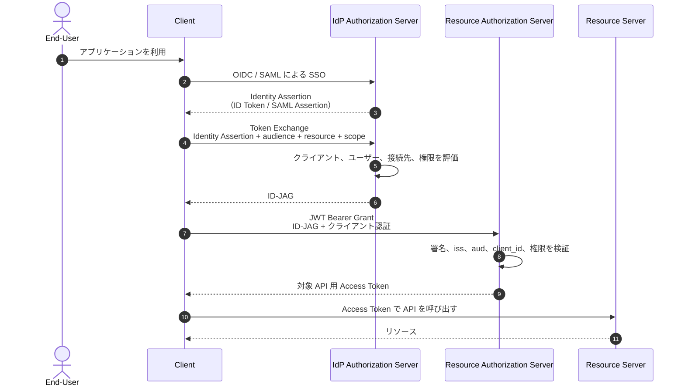

## 概要

ID-JAG（Identity Assertion JWT Authorization Grant）は、あるアプリケーションがユーザーに代わって別の信頼ドメインにある API へアクセスする際に、共通の Identity Provider（IdP）を介して権限委譲するための署名付き JWT である。

- OAuth 2.0 Token Exchange（[RFC 8693](https://www.rfc-editor.org/rfc/rfc8693)）で IdP から ID-JAG を取得する
- JWT Bearer Authorization Grant（[RFC 7523](https://www.rfc-editor.org/rfc/rfc7523)）で ID-JAG を対象システムのアクセストークンへ交換する
- 対象システムの認可サーバーでユーザーを直接操作させず、IdP の管理ポリシーを権限委譲に反映できる
- Cross-App Access（XAA）は、この仕組みを使ってアプリケーション間の API アクセスを仲介するパターンの通称である

ID-JAG 自体は API を呼び出すアクセストークンではない。IdP が「このクライアントが、このユーザーに代わり、この認可サーバーおよびリソース向けのトークンを要求してよい」と表明する、短期間有効な**認可グラント**である。

> [!warning]
> 2026-07-03 時点の仕様は、IETF OAuth Working Group の Standards Track Internet-Draft `draft-ietf-oauth-identity-assertion-authz-grant-04` であり、まだ RFC ではない。実装時は[最新版](https://datatracker.ietf.org/doc/draft-ietf-oauth-identity-assertion-authz-grant/)との差分を確認する。

## 解決する課題

通常の SSO と OAuth の組み合わせでは、次の 2 つは独立している。

- IdP は、ユーザーが各アプリケーションへログインできるかを制御する
- ユーザーは、クライアントから別アプリケーションの API へアクセスする権限を、OAuth の同意画面で個別に委譲する

この場合、アプリケーション間の権限委譲は IdP から見えず、組織が一元的に許可・拒否しにくい。ID-JAG では、IdP がクライアント、ユーザー、接続先、リソース、スコープを評価して認可グラントを発行するため、組織のポリシーを API アクセスにも適用できる。

ただし、最終的な権限を IdP だけで決定する仕組みではない。対象システムの認可サーバーもローカルポリシーを評価し、ID-JAG に示された `resource`、`scope`、`authorization_details` と同じか、それより狭い権限のアクセストークンを発行する。

## 登場する要素

| 要素                          | 役割                                                                     |
| ----------------------------- | ------------------------------------------------------------------------ |
| End-User                      | クライアントを利用し、API アクセスの主体となるユーザー                   |
| Client                        | ユーザーに代わって別システムの API を利用するアプリケーション            |
| IdP Authorization Server      | ユーザーを認証し、組織のポリシーに基づいて ID-JAG を発行する認可サーバー |
| Resource Authorization Server | ID-JAG を検証し、対象 API 用のアクセストークンを発行する認可サーバー     |
| Resource Server               | 発行されたアクセストークンを受け入れる対象 API                           |

ID-JAG は、Resource Authorization Server が IdP を SSO とユーザー識別のために既に信頼していることを前提とする。

## フロー



### 1. IdP から ID-JAG を取得する

クライアントは、SSO で得た ID Token または SAML Assertion を `subject_token` として IdP の Token Endpoint へ送る。IdP が対応している場合は、IdP が発行した Refresh Token も利用できる。

```http
POST /token HTTP/1.1
Host: idp.example.com
Content-Type: application/x-www-form-urlencoded

grant_type=urn:ietf:params:oauth:grant-type:token-exchange
&requested_token_type=urn:ietf:params:oauth:token-type:id-jag
&audience=https://auth.resource.example.com/
&resource=https://api.resource.example.com/
&scope=data.read
&subject_token=<ID_TOKEN>
&subject_token_type=urn:ietf:params:oauth:token-type:id_token
```

- `audience` は、ID-JAG を処理する Resource Authorization Server を示す
- `resource` は、アクセス先の Resource Server を示す
- IdP は `resource`、`scope`、`authorization_details` をポリシーに応じて狭められる
- `subject_token` が Identity Assertion の場合、IdP はその宛先がリクエスト中の認証済みクライアントと一致することを検証する
- 上記とは別に、クライアントは IdP に対して自身を認証する

成功時の Token Exchange レスポンスでは、RFC 8693 の形式上、ID-JAG が `access_token` フィールドに格納される。しかし、これは OAuth アクセストークンではないため `token_type` は `N_A` になる。

```json
{
  "issued_token_type": "urn:ietf:params:oauth:token-type:id-jag",
  "access_token": "<ID_JAG>",
  "token_type": "N_A",
  "scope": "data.read",
  "expires_in": 300
}
```

### 2. ID-JAG をアクセストークンへ交換する

クライアントは、ID-JAG を JWT Bearer Authorization Grant として Resource Authorization Server の Token Endpoint へ送る。このリクエストでもクライアント認証が必要になる。

```http
POST /token HTTP/1.1
Host: auth.resource.example.com
Content-Type: application/x-www-form-urlencoded

grant_type=urn:ietf:params:oauth:grant-type:jwt-bearer
&assertion=<ID_JAG>
```

Resource Authorization Server は ID-JAG とローカルポリシーを検証し、Resource Server で使用できるアクセストークンを発行する。

## ID-JAG の構造

### 必須ヘッダー

| パラメータ | 内容                                                |
| ---------- | --------------------------------------------------- |
| `typ`      | `oauth-id-jag+jwt`。別用途の JWT との取り違えを防ぐ |

署名アルゴリズムを示す `alg` や鍵を特定する `kid` も通常の JWS と同様に使われるが、具体的な値は信頼関係と鍵管理方式に依存する。

### 必須クレーム

| クレーム    | 内容                                                                 |
| ----------- | -------------------------------------------------------------------- |
| `iss`       | ID-JAG を発行した IdP Authorization Server の識別子                  |
| `sub`       | IdP の名前空間における End-User の識別子                             |
| `aud`       | ID-JAG を処理する Resource Authorization Server の issuer identifier |
| `client_id` | Resource Authorization Server 側で登録されたクライアントの識別子     |
| `jti`       | ID-JAG を一意に識別する値                                            |
| `exp`       | 有効期限                                                             |
| `iat`       | 発行日時                                                             |

### 主な任意クレーム

| クレーム                    | 内容                                                                                    |
| --------------------------- | --------------------------------------------------------------------------------------- |
| `resource`                  | 対象 Resource Server の識別子                                                           |
| `scope`                     | 許可された OAuth スコープ                                                               |
| `authorization_details`     | Rich Authorization Requests（RAR）による構造化された認可内容                            |
| `auth_time` / `acr` / `amr` | ユーザー認証の日時、保証レベル、認証方式                                                |
| `tenant`                    | マルチテナント IdP におけるテナント識別子                                               |
| `aud_tenant` / `aud_sub`    | 接続先テナントと、接続先が認識するユーザー識別子                                        |
| `sub_id`                    | SAML NameID など、Resource Authorization Server が SSO で使う別名前空間のユーザー識別子 |
| `email`                     | アカウント解決に利用できるメールアドレス                                                |
| `act`                       | ユーザーに代わって動作する actor の情報                                                 |
| `cnf`                       | DPoP などで ID-JAG を暗号鍵にバインドするための情報                                     |

`actor_token` と `act` の具体的な検証・認可方法は、`draft-04` では規定されていない。AI Agent 自体のアイデンティティや委譲関係を表現する場合は、追加プロファイルが必要になる。

## ID Token、ID-JAG、Access Token の違い

| 項目                     | ID Token                       | ID-JAG                                         | Access Token                           |
| ------------------------ | ------------------------------ | ---------------------------------------------- | -------------------------------------- |
| 主目的                   | クライアントに認証結果を伝える | 別ドメインの認可サーバーへ権限委譲を伝える     | Resource Server の API を利用する      |
| 主な発行者               | IdP                            | IdP                                            | Resource Authorization Server          |
| 主な受信者               | OIDC Client                    | Resource Authorization Server                  | Resource Server                        |
| `aud` の対象             | OIDC Client                    | Resource Authorization Server                  | 対象リソースまたはそのポリシーに従う値 |
| API 呼び出しに直接使うか | 使わない                       | 使わない                                       | 使う                                   |
| 含む文脈                 | ユーザー認証                   | ユーザー、クライアント、接続先、委譲可能な権限 | 実際に付与された API 権限              |

ID Token を対象システムへそのまま渡すのではなく、接続先に合わせて `aud`、`client_id`、`resource`、`scope` などを持つ ID-JAG を改めて発行する点が重要である。

## セキュリティと実装上の注意点

### 検証を二段階で行う

- IdP は `subject_token` の署名、発行者、有効期限、宛先、認証済みクライアントとの結び付きを検証する
- Resource Authorization Server は ID-JAG の署名と信頼する `iss`、`typ`、有効期限を検証する
- `aud` は Resource Authorization Server 自身の issuer identifier と完全に一致させる
- ID-JAG の `client_id` と、Token Endpoint で認証したクライアントを一致させる
- `sub` は `iss` と組み合わせて扱い、マルチテナントでは `tenant` も識別範囲に含める
- Resource Authorization Server は IdP の判断を上限とし、ローカルポリシーで `resource`、`scope`、`authorization_details` を再評価する

### クライアント登録と識別子の対応が必要

このフローには、次の 3 つの独立した関係がある。

1. Client と IdP の SSO 関係
2. Client と Resource Authorization Server の OAuth クライアント関係
3. Resource Authorization Server と IdP の SSO・ユーザー解決関係

Client は IdP と Resource Authorization Server で異なる `client_id` を持つ可能性がある。IdP は Resource Authorization Server が認識する `client_id` を ID-JAG に入れる必要があるため、事前登録や識別子のマッピングが必要になる。Pairwise Subject Identifier や SAML NameID を使う場合は、ユーザー識別子のマッピングも必要である。

### Confidential Client を前提とする

IETF Draft は、ID-JAG を Confidential Client のみで利用することを推奨している。Client は IdP と Resource Authorization Server の双方に自身を認証する必要がある。秘密を安全に保持できない Public Client には、Resource Authorization Server へリダイレクトする通常の Authorization Code Grant が推奨される。

### 再利用と漏えいを考慮する

ID-JAG は必ずしも使い捨てではない。仕様上、ID-JAG の有効期間内であれば、同じ ID-JAG を再提示して新しいアクセストークンを取得できる。そのため、短い有効期間、`jti` の監視、必要に応じた DPoP による鍵バインディングなどを検討する。

IdP で権限を削除すると新しい ID-JAG の発行は止められるが、発行済み ID-JAG やアクセストークンが即座に無効になるとは限らない。失効までの時間は、トークンの有効期間、失効・Introspection・イベント連携など各実装の仕組みに依存する。

### 信頼ドメインと用途を限定する

- 同じ ID-JAG を `aud` が異なる別の Resource Authorization Server へ転用しない
- ID-JAG を発行した IdP が、同一信頼ドメイン内でその ID-JAG を受けてアクセストークンを発行しない
- `sub_id` など追加の識別子はクライアントからも見えるため、ユーザー解決に必要な最小限の情報だけを含める
- ステップアップ認証が必要な場合、IdP は `insufficient_user_authentication` を返し、クライアントに再認証を要求できる

## MCP との関係

ID-JAG は MCP 専用の仕組みではなく、一般的な OAuth の権限委譲プロファイルである。

Model Context Protocol（MCP）では、公式の [Enterprise-Managed Authorization](https://modelcontextprotocol.io/extensions/auth/enterprise-managed-authorization) 拡張が ID-JAG を利用している。組織の IdP が MCP Client から MCP Server へのアクセスを一元管理し、ユーザーごとの接続・同意操作を減らすための構成である。この拡張は 2026-06-18 に stable として[発表された](https://blog.modelcontextprotocol.io/posts/enterprise-managed-auth/)。

- 拡張識別子は `io.modelcontextprotocol/enterprise-managed-authorization`
- MCP Client は IdP から対象 MCP Authorization Server 向けの ID-JAG を取得する
- MCP Authorization Server は ID-JAG を検証して MCP Server 用のアクセストークンを発行する
- IdP、MCP Client、MCP Authorization Server のすべてが拡張と ID-JAG フローに対応する必要がある

Okta は ID-JAG を利用する製品・実装を [Cross App Access（XAA）](https://developer.okta.com/blog/2026/02/17/xaa-resource-app) と呼んでいる。XAA は一般に ID-JAG と同義の仕様名ではなく、ID-JAG を利用した Cross-App Access パターンおよび Okta の実装名として区別する。

## 導入チェックリスト

- [ ] IdP が `urn:ietf:params:oauth:token-type:id-jag` の発行に対応している
- [ ] Resource Authorization Server が ID-JAG と JWT Bearer Grant の処理に対応している
- [ ] Client が Token Exchange と JWT Bearer Grant の両方に対応している
- [ ] IdP と Resource Authorization Server の間で署名鍵、issuer、テナントの信頼関係が確立されている
- [ ] Client の `client_id` と End-User の `sub` を信頼ドメイン間で正しく対応付けられる
- [ ] IdP と Resource Authorization Server の双方で、リソースと権限を最小化するポリシーがある
- [ ] ID-JAG とアクセストークンの有効期間、失効、監査、漏えい時の対応を設計している
- [ ] 必要に応じて DPoP などの Sender-Constrained Token を利用する
- [ ] Internet-Draft の更新と、製品固有の実装差を継続的に確認する

## 参照リンク

- [Identity Assertion JWT Authorization Grant（IETF Internet-Draft）](https://datatracker.ietf.org/doc/draft-ietf-oauth-identity-assertion-authz-grant/)
- [OAuth 2.0 Token Exchange（RFC 8693）](https://www.rfc-editor.org/rfc/rfc8693)
- [JSON Web Token Profile for OAuth 2.0 Client Authentication and Authorization Grants（RFC 7523）](https://www.rfc-editor.org/rfc/rfc7523)
- [Resource Indicators for OAuth 2.0（RFC 8707）](https://www.rfc-editor.org/rfc/rfc8707)
- [OAuth 2.0 Rich Authorization Requests（RFC 9396）](https://www.rfc-editor.org/rfc/rfc9396)
- [OAuth 2.0 Demonstrating Proof of Possession（DPoP）（RFC 9449）](https://www.rfc-editor.org/rfc/rfc9449)
- [Enterprise-Managed Authorization（Model Context Protocol）](https://modelcontextprotocol.io/extensions/auth/enterprise-managed-authorization)
- [Develop a XAA-Enabled Resource Application and Test with Okta](https://developer.okta.com/blog/2026/02/17/xaa-resource-app)
